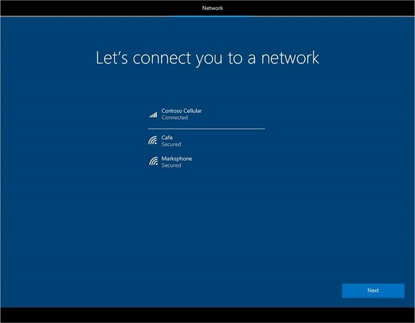

# Connect users to the network

During the OOBE flow, the customer will see the **Let’s connect you to a network** screen. In Windows 10 build 1709, this screen is now shown prior to the EULA screen during OOBE. **Let’s connect you to a network** shows any connection options available to the user, including in-range Wi-Fi and Cellular data networks.

## Connect to Cellular and/or Wi-Fi networks

If the device is LTE-enabled and an active SIM card is inserted, Windows will connect to the Cellular data network automatically. This enables the user to go through OOBE and successfully setup their device if a local Wi-Fi connection is not available. The user will see they are Connected to the Cellular data network when they reach the **Let’s connect you to a network** screen in OOBE. Available Wi-Fi connections will also be shown on the screen, and the user can choose to connect to Wi-Fi if desired.

If the device is LTE-enabled, but no SIM card is present, Cellular data will appear as a connection option along with any available Wi-Fi networks. The user must insert a SIM card before they can connect to the Cellular network.

A user can choose to connect to both a Wi-Fi and Cellular network at the same time. In this case, Wi-Fi will be used throughout OOBE and no data traffic is transmitted via the Cellular network (metered connection). Windows will always use the Wi-Fi connection if it is available. Cellular will only be used if the user is out of range of their Wi-Fi network, or chooses to disconnect from Wi-Fi.

Windows has logic in place to protect the user from draining their data during OOBE if they are on a metered connection (either metered Cellular or metered Wi-Fi). For example, if a user is on a metered network, only critical updates (for example, critical driver updates and zero-day patch (ZDP) Windows updates) are allowed on the device.

For more information on the cellular settings for Windows 10 users, see [Cellular settings in Windows 10](https://support.microsoft.com/en-us/help/10739/windows-10-cellular-settings).

## Download critical updates after connecting

Immediately after the user connects to a network, critical driver updates, and Windows ZDP updates, will begin downloading to the device. Only critical updates that are required for the device to function, such as security fixes, will download during this time. As such, the user can't opt out of downloading them. The time required to download the updates depends on the size of the download and the user's network conditions. Their device may restart automatically during the download.

If a newer version of Windows has become available since the device was shipped, the user will be asked if they would like to download this non-critical Windows Update at the end of OOBE. For more information, see [Windows updates during OOBE](windows-updates-during-oobe.md).