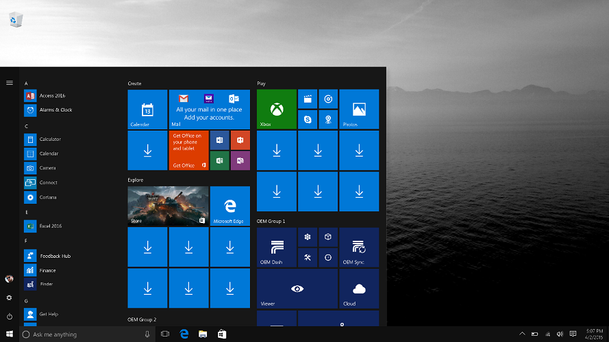
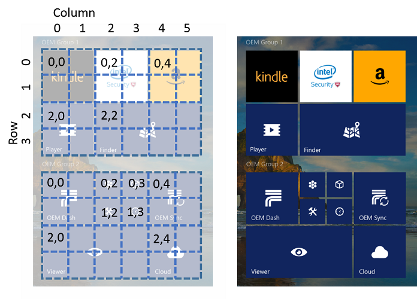

# Customize the Start layout

You can customize the Start layout by creating a `LayoutModification.xml` file, and configuring the settings.

You are able to customize the Start layout by:

* Changing the size of the Start menu
* Adding new apps and weblinks as tiles to the Start menu
* Specifying the size and position of the new tiles

> [!Tip]
> For an inclusive list of settings you can configure in `LayoutModification.xml`, as well as a full XML Example, see [Start layout XML for desktop editions of Windows 10](https://docs.microsoft.com/en-us/windows/configuration/start-layout-xml-desktop).

## Customize the size of the Start menu

We recommend that you set the default Start menu so it is not greater than 40% of the size of the desktop. If it is greater than half the width of the desktop, customers might perceive that the device and Windows are optimized only for touch, and feel less satisfied when they use a mouse and keyboard.

You have three options for the Start menu size: **small** (one column of tiles), **medium** (2 columns of tiles), or **full screen**. New devices running Windows for desktop will default to a Start menu with two columns of tiles unless boot to tablet mode is enabled. Devices with screens that are under 10" have boot to tablet mode enabled by default. For these devices, users see the **full screen** Start menu on the desktop.

> [!Note]
> We suggest you leave the default values for these features so that Windows can use its own logic to do the right thing for the customer. You can, however, adjust the following OS features if you have a scenario that requires it. For example, if you have a device that is meant mainly for use as a tablet, but is bigger than 10", you can use [SignInMode](https://docs.microsoft.com/en-us/windows-hardware/customize/desktop/unattend/microsoft-windows-shell-signinmode).

Here is how you set the size of the start menu, using LayoutModification.xml.

* To set as small, with one column of tiles:
  ```xml
  <LayoutOptions
     StartTileGroupsColumnCount="1"
     FullScreenStart="false"
  />
  ```
* To set as medium, with two columns of tiles:
  ```xml
  <LayoutOptions
     StartTileGroupsColumnCount="2"
     FullScreenStart="false"
  />
  ```
* To set as full screen (and set the default to one column if the user disables full screen):
  ```xml
  <LayoutOptions
     StartTileGroupsColumnCount="1"
     FullScreenStart="true"
  />
  ```

> [!Important]
> Setting `FullScreenStart` to true requires rebooting the device to take effect.

## Add tiles to the Start menu

You can pin tiles in two OEM groups. These groups can either be set such that all tile groups are 3 medium tiles wide or so that all tile groups are 4 medium tiles wide. When this setting is changed to 4 medium tiles wide then group one is 3 high by 4 wide and group two is 2 high by 4 wide.

> [!Note]
> Each tile pinned to the Start menu launches a single app. A tile can’t be a group of apps or a folder.

OEM groups are added at the end of the Start menu; you will not be able to manipulate or otherwise change the Microsoft groups and tiles within them. The default layout is applied based on SKU and region and then the LayoutModification.xml or Unattend.xml file is processed. The first, bigger OEM group displays the first two rows by default, with only the titles of the tiles on the third row displaying. The smaller OEM group displays only the titles of the top row.

> [!Important]
> Universal apps or Store apps must be pinned to the Start menu to be pre-installed on the device, otherwise they will be removed on any system that uses that layout. Desktop apps do not have to be pinned to the Start menu to be pre-installed on the device.

Some apps on the Start Menu are downloaded dynamically after the Out of Box Experience (OOBE) completes. If the device is on a metered network, or without network connectivity, app downloads are paused, and the user will see down arrows instead of the app name on the app tiles, as in the following image.



The downloads start or resume after the network connects.

## Customize the size and position of your tiles

The `LayoutModification.xml` file allows four tile size options and the ability to pin websites as tiles. The available tile sizes are:

* Small tile: 1x1
* Medium square tile: 2x2
* Wide tile: 4x2
* Large tile: 4x4

The `Row` and `Column` elements determine the position of the tile within the group. The `0,0` position is the first row, first column.

For example, here is a Start layout with the row and column grid overlaid.



### Add weblink tiles

You can add a web link tile that will open in the default browser, or you can add a *secondary tile* that will specifically open in Microsoft Edge.
To create a web link tile that will open in the default browser, create a .url file:

1. Right click on Desktop > New > Shortcut
1. Type a URL such as http://www.fabrikam.com
1. Click Next
1. Type a name for the shortcut such as Fabrikam and click Finish. The .url file is saved to your desktop.
1. Add the .url file to the image in the `%ALLUSERSPROFILE%\Microsoft\Windows\Start Menu\Programs\` folder , and then add a `DesktopApplicationTile` element to `LayoutModification.xml`:

   ```XML
   <!-- Web link tile with associated .url file in StartMenu folder -->
   <start:DesktopApplicationTile
          DesktopApplicationID="www.Fabrikam.com"
          Size="2x2"
          Row="0"
          Column="2"/>
   ```

To create a secondary tile (a web link tile that will open in Microsoft Edge), add a `SecondaryTile` element to `LayoutModification.xml` and specify Edge in the `AppUserModelID` attribute.

> [!Note]
> The actual Edge tile cannot be customized. The icon, text and the page that it launches must remain the default. 

The OEM-custom icon and supporting text in the tile must:

* Logically relate to the activity or action the user is expected to take
* Launch the Edge browser
* The icon and supporting text should not imply that it is anything other than Edge (e.g. another browser)
* The page that it goes to must work in Edge
* The page should not promote another browser

```XML
<start:SecondaryTile AppUserModelID="Microsoft.MicrosoftEdge_8wekyb3d8bbwe!MicrosoftEdge"
          TileID="MyWeblinkTile"
          Arguments="http://msn.com"
          DisplayName="MySite"
          Square150x150LogoUri="ms-appx:///Assets/MicrosoftEdgeSquare150x150.png"
          Size="2x2"
          Row="0"
          Column="4"/>
```

## Add an Office suite or Office download tile to Start

`LayoutModification.xml` supports adding either the in-box installed Office suite to Start (Word, Excel, PowerPoint), or adding a "Download Office" tile to a specific location in Start (the bottom right of the second group).

> [!Note]
> These two options are mutually exclusive; adding both is not supported.

If you want to append the Office Mobile Suite of tiles that point to the office mobile download, add the `<AppendOfficeSuite/>` tag to your `LayoutModification.xml` file. This replaces "Get Office" with the pre-installed Universal apps.

```XML
<LayoutModificationTemplate xmlns="http://schemas.microsoft.com/Start/2014/LayoutModification" xmlns:defaultlayout="http://schemas.microsoft.com/Start/2014/FullDefaultLayout" xmlns:start="http://schemas.microsoft.com/Start/2014/StartLayout" Version="1">
<AppendOfficeSuite/>
</LayoutModificationTemplate>
```

## First run tasks

First Run Tasks are background tasks that are active when the user first signs into Windows. FirstRunTask is not available in `LayoutModification.xml`. However, you can still use it by including an Unattend.xml file with [StartTiles](https://docs.microsoft.com/en-us/windows-hardware/customize/desktop/unattend/microsoft-windows-shell-setup-starttiles) tags using the same AppID as in `LayoutModification.xml`.

If the `AppendGroup` tag is present in `LayoutModification.xml`, it will override Unattend.xml for all Start pinning. However, if an Unattend.xml [StartTiles](https://docs.microsoft.com/en-us/windows-hardware/customize/desktop/unattend/microsoft-windows-shell-setup-starttiles) tag exists for the same AppID as in LayoutModification.xml, the FirstRunTask from Unattend.xml will be respected.

For example, include a `LayoutModfication.xml` file specifying an app like this:

```XML
<start:Tile AppUserModelID="Microsoft.MicrosoftEdge_8wekyb3d8bbwe!MicrosoftEdge" Size="2x2" Row="0" Column="0"/>
```

Also include an Unattend.xml file specifying the same AppID like this:

```XML
<SquareOrDesktopTile5>
<AppId>Microsoft.MicrosoftEdge_8wekyb3d8bbwe!MicrosoftEdge</AppId>
<FirstRunTask>BackgroundTasks_Notifications.Services.MessagingBackgroundTask</FirstRunTask>
</SquareOrDesktopTile5>
```

## Related topics

* [Start layout XML for desktop editions of Windows](https://docs.microsoft.com/en-us/windows/configuration/start-layout-xml-desktop)
* [Add the LayoutModification.xml file to the device](https://docs.microsoft.com/en-us/windows/configuration/start-layout-xml-desktop#add-the-layoutmodificationxml-file-to-the-device)