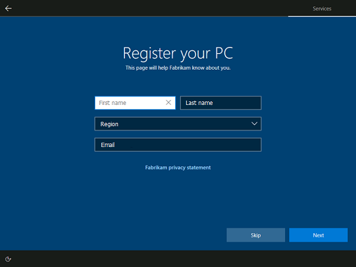
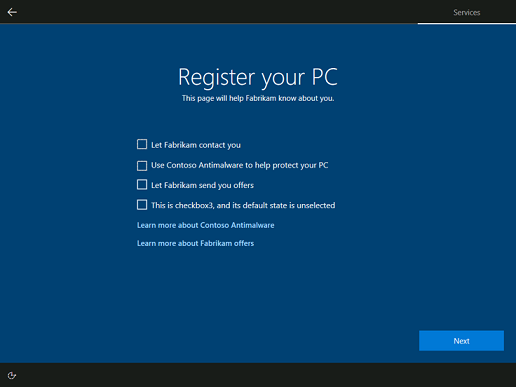

# Design your registration pages

The OEM registration pages present many customization opportunities. This topic describes all elements on each of the two OEM registration pages, indicating the customization options for each element. This topic also provides style guidance and code samples you can use to design your registration pages.

The layout of each page is locked, so the page elements themselves can't be rearranged.

> [!Note]
> A minimum amount of information is required for the registration pages to display. You must provide a page title, a page subtitle, a consent checkbox label (provided via the `customerinfo` elements of [Oobe.xml](registration-pages-oobexml.md)), and at least one checkbox **or** one link.

## OEM registration page one

The first OEM registration page includes the elements below, some of which you can customize.



* **Page title**. Create a title that makes sense for your use of the page. This title also appears on registration page two.
* **Page subtitle**. Add a subtitle to help customers understand the tasks on the page or in some other way guide them to complete the form. This subtitle also appears on registration page two. The page title and subtitle can be customized using the `registration` element of [Oobe.xml](registration-pages-oobexml.md).
* **Customer information fields**. These fields are not customizable. Customer information consists of four input fields: First Name, Last Name, Region, and Email. If the Email field is filled in, it will be validated as well-formed prior to allowing the customer to proceed. The Country/Region input field is a drop-down list. The associated value of each country/region is its associated two-letter country/region code based on [ISO 3166-1 Alpha-2](https://www.iso.org/obp/ui/#search/code).
* **One link**. Customize the title, and path to, an HTML file using the `link1` element of [Oobe.xml](registration-pages-oobexml.md).
* **Skip button**. The Skip button is visible by default, but you can configure the `hideSkip` element of [Oobe.xml](registration-pages-oobexml.md) to hide it. No customer information is sent to Userdata.blob if the customer chooses Skip. The button text is not customizable.
* **Next button**. The Next button moves the customer forward in OOBE. This button is not customizable.

### Pre-populated customer information

When a user signs in or signs up for an MSA in OOBE, they have already provided some of the information requested on the OEM Registration pages. To streamline the setup process for users, Windows pre-populates some of the customer information fields on OEM registration page one, if the customer signed into or signed up for an MSA earlier in OOBE.

Depending on the SKU a user may choose to setup different account choices which will impact whether the account information is pre-filled.

| Account path                              | OEM page pre-filled                                                    |
|:------------------------------------------|:-----------------------------------------------------------------------|
| Microsoft account sign up                 | First name, last name, email                                           |
| Microsoft account sign in                 | First name, last name, email                                           |
| Azure AD account sign in                  | Nothing pre-filled                                                     |
| Local account creation                    | Nothing pre-filled                                                     |

## OEM registration page two

The second OEM registration page includes the elements below, some of which you can customize.



* **Consent checkbox**. The top checkbox on OEM registration page two allows the customer to provide their consent to pass their customer information to Userdata.blob. You can customize the label, and the default value of the consent checkbox, via the `customerinfo` element of [Oobe.xml](registration-pages-oobexml.md).
* **Three checkboxes**. Up to three additional checkboxes with labels can be displayed beneath the consent checkbox. You can set the descriptive label for the checkboxes, and their default state, using the `checkbox1`, `checkbox2`, and `checkbox3` elements of [Oobe.xml](registration-pages-oobexml.md).
* **Two links**. Up to two links can be displayed beneath the checkboxes. You can specify the link labels and file paths using the `link2` and `link3` elements of [Oobe.xml](registration-pages-oobexml.md). Any text you associate with these links must be in HTML files stored locally in the `OOBE\Info` directory.

### Consent checkbox

Whether or not customer information is passed to Userdata.blob is determined by the consent check box. If the box is checked, any information in the four customer information fields will be sent to Userdata.blob. If you've specified an OEM App in Oobe.xml, the information is also sent to that OEM App using asymmetric key encryption. If the box is not checked, customer information is not passed to Userdata.blob, nor is it sent to the OEM App. This behavior holds true regardless of if there is any information typed into the input fields.

To learn more about using an OEM App to access the customer information, see [Collect and manage user data](manage-user-data.md).

## Style guidance

Windows OOBE has a dark blue background with light text. End User License Agreement (EULA) content uses a dark blue background and light text. Fly-out content uses a dark background with light text. To align with this guidance please ensure that the markup and style conventions HTML sample files are followed precisely.

> [!Note]
> Inline CSS styling is required so that the iFrame host elements render correctly in the registration pages.

### Colors

Text and background colors are defined in the [CSS code example](#css-example).

### Font

The standard font used throughout OOBE is Segoe UI. Please use the Segoe UI Webfont for your HTML documents to ensure the font matches the rest of OOBE.

### Sizes and spacing

Use two different styles for headers and body content.

* Headers: should be rendered using the `<h4>` tag.
* Body text: should be rendered using the `<p>` tag.
* Bold text: should be rendered using the `<b>` tag.
* Hierarchy of information: indented sections or groups of bulleted items can be displayed with the `<DIR>` tag, required for EULA content template, optional for Flyouts.

We require that the files for the in-place links are HTML. These files are rendered in a flyout. Documents in the flyout are sandboxed, such that links to external and online resources will not function.

> [!Important]
> The following tags are prohibited and should not be included in your files:
>
> * `<script>`
> * `<iframe>`
> * `<input>`
> * ``
> * `<a>`
>

## <a name="css-example"></a>CSS code example

Please use the following inline CSS in the head of your HTML documents.

```css
<style type="text/css">
        [dir='rtl'] dir {
            padding: 0 12px;
        }

        [dir='ltr'] dir {
            padding: 0 12px;
        }

        [dir='ltr'] [align=right] {
            text-align: right;
        }

        [dir='ltr'] [align=left] {
            text-align: left;
        }

        [dir='rtl'] [align=right] {
            text-align: left;
        }

        [dir='rtl'] [align=left] {
            text-align: right;
        }

        [dir='rtl'] body {
            padding: 0 12px;
        }

        [dir='ltr'] body {
            padding: 0 12px;
        }

        body {
            -ms-overflow-style: scrollbar;
            background: #2b2b2b;
            color: #FFF;
            font-family: "Segoe UI", "Segoe UI Webfont", "Ebrima", "Nirmala UI", "Gadugi", "Segoe Xbox Symbol", "Segoe UI Symbol", "Meiryo UI", "Khmer UI", "Tunga", "Lao UI", "Raavi", "Iskoola Pota", "Latha", "Leelawadee", "Microsoft YaHei UI", "Microsoft JhengHei UI", "Malgun Gothic", "Estrangelo Edessa", "Microsoft Himalaya", "Microsoft New Tai Lue", "Microsoft PhagsPa", "Microsoft Tai Le", "Microsoft Yi Baiti", "Mongolian Baiti", "MV Boli", "Myanmar Text", "Cambria Math", Selawik, Tahoma, Verdana, Arial, sans-serif;
            font-size: .9375rem;
            font-weight: 400;
            line-height: 1.25rem;
            margin: 0;
            max-width: 100%;
            overflow: auto;
            padding-bottom: 0;
            padding-top: 0;
        }

        body b * {
            font-weight: 700;
        }

        html {
            font-size: 100%;
        }

        p {
            font-size: .9375rem;
            font-weight: 400;
            line-height: 1.25rem;
            max-width: 100%;
            padding-bottom: .0141875rem;
            padding-top: .0141875rem;
        }

        h4 {
            font-size: 1.25rem;
            font-weight: 400;
            line-height: 100%;
            max-width: 100%;
            padding-top: 12px;
            margin: 0;
        }
    </style>
```

## Full HTML example

Here is a full example of an HTML flyout for OEM registration pages:

```html
> <!DOCTYPE html>
<html dir="ltr">
<head>
    <meta charset="utf-8"/>
    <meta name="viewport" content="width=device-width">
    <title></title>
    <style type="text/css">
        [dir='rtl'] dir {
            padding: 0 12px;
        }

        [dir='ltr'] dir {
            padding: 0 12px;
        }

        [dir='ltr'] [align=right] {
            text-align: right;
        }

        [dir='ltr'] [align=left] {
            text-align: left;
        }

        [dir='rtl'] [align=right] {
            text-align: left;
        }

        [dir='rtl'] [align=left] {
            text-align: right;
        }

        [dir='rtl'] body {
            padding: 0 12px;
        }

        [dir='ltr'] body {
            padding: 0 12px;
        }

        body {
            -ms-overflow-style: scrollbar;
            background: #2b2b2b;
            color: #FFF;
            font-family: "Segoe UI", "Segoe UI Webfont", "Ebrima", "Nirmala UI", "Gadugi", "Segoe Xbox Symbol", "Segoe UI Symbol", "Meiryo UI", "Khmer UI", "Tunga", "Lao UI", "Raavi", "Iskoola Pota", "Latha", "Leelawadee", "Microsoft YaHei UI", "Microsoft JhengHei UI", "Malgun Gothic", "Estrangelo Edessa", "Microsoft Himalaya", "Microsoft New Tai Lue", "Microsoft PhagsPa", "Microsoft Tai Le", "Microsoft Yi Baiti", "Mongolian Baiti", "MV Boli", "Myanmar Text", "Cambria Math", Selawik, Tahoma, Verdana, Arial, sans-serif;
            font-size: .9375rem;
            font-weight: 400;
            line-height: 1.25rem;
            margin: 0;
            max-width: 100%;
            overflow: auto;
            padding-bottom: 0;
            padding-top: 0;
        }

        body b * {
            font-weight: 700;
        }

        html {
            font-size: 100%;
        }

        p {
            font-size: .9375rem;
            font-weight: 400;
            line-height: 1.25rem;
            max-width: 100%;
            padding-bottom: .0141875rem;
            padding-top: .0141875rem;
        }

        h4 {
            font-size: 1.25rem;
            font-weight: 400;
            line-height: 100%;
            max-width: 100%;
            padding-top: 12px;
            margin: 0;
        }
    </style>
</head>
<body>
<H4>Learn more about the sample</H4>
<P>Quisque efficitur lorem nec mauris semper consequat. Aliquam sollicitudin rhoncus sollicitudin. Integer ligula mauris, euismod ac lacus et, cursus pulvinar mauris. Aliquam sollicitudin blandit vehicula. Morbi ac arcu vitae mi placerat facilisis eu sed enim. Ut ornare aliquet tincidunt. Maecenas posuere et nisi in tempor.</P>
<B><P>Donec malesuada bibendum nibh, in semper nunc efficitur sit amet. Vestibulum vehicula hendrerit elit et congue.</P>
  <DIR>
    <DIR>

      <P>1.&#9;Pellentesque mollis cursus ultrices.</P>
      <DIR>

        <P>a.&#9;Vivamus ut suscipit arcu.
</B> Donec viverra tortor lacus, eu aliquam dolor auctor quis. Praesent eget tincidunt metus, non pellentesque metus. </P>
<B><P>b.&#9;Nulla tincidunt urna et tortor gravida, id dictum ligula lacinia.</B> Vivamus libero mauris, fermentum et pharetra id, ultricies quis urna.</P>
<DIR>
  <DIR>

    <P>(i)&#9;Suspendisse porta vestibulum risus, et molestie est egestas ut.</P>
    <P>(ii)&#9; Nullam feugiat, odio vel convallis fringilla, libero nibh volutpat metus, a ultrices justo est id nisl.</P>
    <P>(iii)&#9;Nunc vulputate turpis at eleifend malesuada.</P>
    <P>(iv)&#9;Cras maximus mi porta arcu vehicula elementum.</P></DIR>
</DIR>
</DIR>

<B><P>2.&#9;Nullam ullamcorper placerat finibus.</B> Lorem ipsum dolor sit amet, consectetur adipiscing elit. Donec vitae tincidunt quam, viverra vehicula urna. Sed sit amet volutpat ex, id egestas odio.
Aliquam at urna mollis, commodo ex sit amet, auctor erat. Proin elit neque, pretium ut lorem eget, cursus condimentum ante. Quisque placerat tempor nunc, a pulvinar augue interdum sit amet. Sed eget sem quis tellus rutrum rhoncus. Suspendisse potenti. Vestibulum sem ipsum, volutpat ac condimentum ut, porttitor ac nulla. Quisque rhoncus sapien eu dolor posuere, ac auctor mi dapibus. Aenean egestas mauris sed tellus dapibus, sed sagittis velit volutpat:</P>
<DIR>
  <DIR>
    <DIR>

      <P>·&#9;Sed mattis varius libero.</P>
      <P>·&#9;Maecenas eget ultrices risus.</P>
      <P>·&#9;Maecenas venenatis tellus id euismod venenatis.</P>
      <P>&#12288;</P></DIR>
  </DIR>
</DIR>
</DIR>
</DIR>
</body>
</html>
```