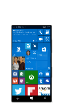
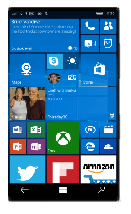

# Smartphone

Smartphones come in a wide range of sizes from low cost phones, small tablets (phablets) and industrial handheld devices. A typical smartphone combines cellular connectivity, a touch screen, rechargeable power source, and other components into a single chassis. Windows 10 Mobile can support a wide range of small form factors devices. Listed below are a few recommended hardware configurations.

<table>
<tbody valign="top">
<tr>
<td>&nbsp;</td>
<td colspan="2">

</td>
<td>

</td>
</tr>
<tr>
<td bgcolor="EEEEEE">
Type
</td>
<td>

Value Phone

</td>
<td>

Premium Phone

</td>
<td>

Value Phablet

</td>
</tr>
<tr>
<td bgcolor="EEEEEE">Key Features</td>
<td>

Low cost

[Cortana](../device-experiences/cortana.md)

</td>
<td>

[Cortana](../device-experiences/cortana.md)

[Windows Hello](../device-experiences/windows-hello.md)

[Continuum for Phones](../device-experiences/continuum-phone.md)

</td>
<td>

[Cortana](../device-experiences/cortana.md)

[Windows Hello](../device-experiences/windows-hello.md)

</td>
</tr>
<tr>
<td bgcolor="EEEEEE">Operating System</td>
<td colspan="3">Windows&nbsp;10 Mobile</td>
</tr>
<tr>
<td colspan="4" bgcolor="EEEEEE">
[Recommended Components](../component-guidelines/components.md)
</td>
</tr>
<tr>
<td bgcolor="EEEEEE">
CPU
</td>
<td>
Supported entry SoC
</td>
<td>
Supported premium SoC
</td>
<td>
Mid tier supported SoC
</td>
</tr>
<tr>
<td bgcolor="EEEEEE">
RAM/Storage
</td>
<td>
1&nbsp;GB&nbsp;/ 8&nbsp;GB with SD slot
</td>
<td>
2-4&nbsp;GB&nbsp;/ 32-64&nbsp;GB with SD slot
</td>
<td>
2&nbsp;GB&nbsp;/ 16&nbsp;GB with SD slot
</td>
</tr>
<tr>
<td bgcolor="EEEEEE">
Display
</td>
<td>
3.5&rdquo;&ndash;5&rdquo;+&nbsp;/ WVGA -FWVGA-qHD\*
</td>
<td>
4.5&ndash;5.5&rdquo;+&nbsp;/ FHD-WQHD
</td>
<td>
5.5&rdquo;&ndash;7&rdquo;&nbsp;/ 720p+
</td>
</tr>
<tr>
<td bgcolor="EEEEEE">
Dimensions
</td>
<td>
&lt;&nbsp;10.05&nbsp;mm &amp; &lt;&nbsp;135g
</td>
<td>
&lt;&nbsp;7.5&nbsp;mm &amp; &lt;&nbsp;160g
</td>
<td>
&lt;&nbsp;10&nbsp;mm &amp; &lt;&nbsp;175g
</td>
</tr>
<tr>
<td bgcolor="EEEEEE">
Battery
</td>
<td>
1400&nbsp;mAh+ (1 day active use)
</td>
<td>
2500+&nbsp;mAh (1 day active use)
</td>
<td>
3000&nbsp;mAh+ (1 day active use)
</td>
</tr>
<tr>
<td bgcolor="EEEEEE">
Connectivity
</td>
<td>
3G&nbsp;(LTE/Cat&nbsp;3)&nbsp;/&nbsp;802.11b/g/n, microUSB, 3.5&nbsp;mm jack, BT LE
</td>
<td>
LTE/Cat&nbsp;4+&nbsp;/ 802.11b/g/n/ac 2x2, USB, 3.5&nbsp;mm jack, BT LE, NFC
</td>
<td>
LTE/Cat&nbsp;3&nbsp;/ 802.11b/g/n/ac 2x2, USB 3.0 type-c, 3.5&nbsp;mm jack, BT LE, NFC
</td>
</tr>
<tr>
<td bgcolor="EEEEEE">
Camera+
</td>
<td>
5&nbsp;MP, .3&nbsp;MP FFC
</td>
<td>
20&nbsp;MP with OIS/Flash; 5&nbsp;MP FFC
</td>
<td>
5&nbsp;MP, .3&nbsp;MP FFC
</td>
</tr>
</tbody>
</table>

\* qHD requires &gt;&nbsp;512&nbsp;MB memory

Research the Windows Mobile options and partner with a registered Windows phone manufacturer to build a device utilizing your brand. For more information, see [Windows 10 Hardware Developer Programs](http://go.microsoft.com/fwlink/?LinkId=618212).