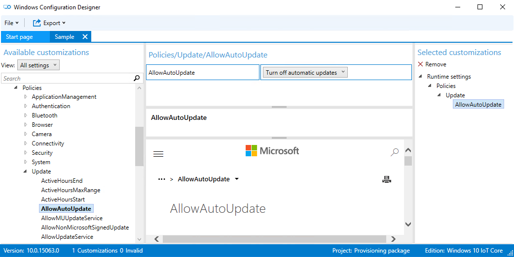
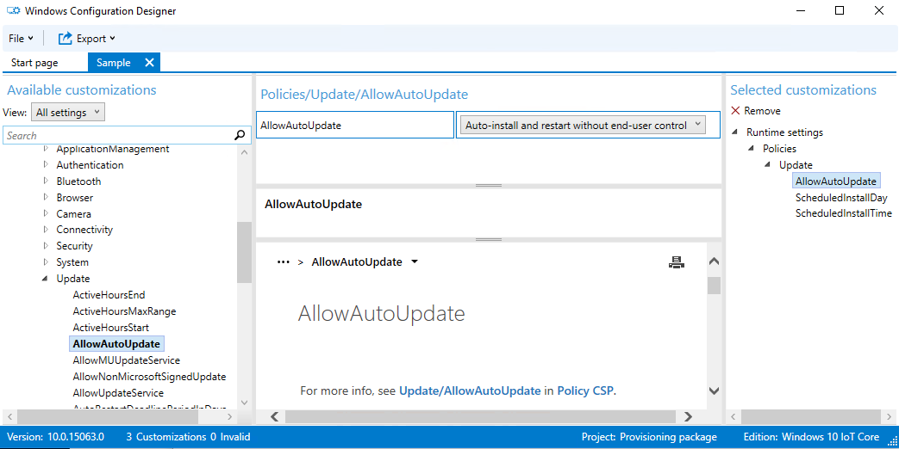
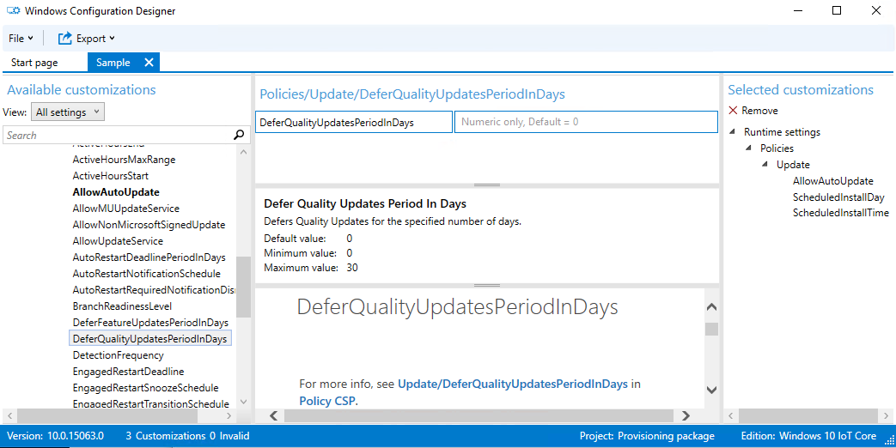

# Manage IoT Core device updates

OEM and enterprise customers using Windows 10 IoT Core can take advantage of device management configuration service providers (CSPs) that allow some control over the device update process.

**Note**  Starting with Windows 10,version 1703, IoT Core Pro is discontinued and update control is enabled in IoT Core.

 

Device Management Policy can be set using either the Windows Imaging and Configuration Designer (ICD) tool or a mobile device management (MDM) service. See [Mobile Device Management](https://docs.microsoft.com/windows/client-management/mdm/index) for more detail about device management protocols.

## AllowAutoUpdate to turn updates on or off

Updates for IoT Core can be turned off by setting the AllowAutoUpdate policy.

-   If the AllowAutoUpdate policy is not configured, it defaults to **Auto-install and restart**, devices will get IoT Core updates and install immediately and reboot after ActiveHours.
-   If the AllowAutoUpdate policy set to **Turn off automatic updates**, automatic updates for IoT Core are turned off.

## AllowAutoUpdate to control updates

The AllowAutoUpdate policy can also control the timing of updates for IoT Core:

If the AllowAutoUpdate policy is set to **Auto-install and restart without end-user control**, IoT Core updates will automatically install and the device will restart at a specified day/time. An IT administrator specifies the install day/time (i.e., every Sunday at 3am). 
If no day/time is specified, the install time defaults to 3 AM daily. All end-user update related notifications are suppressed as well.

View the set day using ` <LocURI>./Vendor/MSFT/PolicyManager/Device/Update/ScheduledInstallDay</LocURI>` or time using ` <LocURI>./Vendor/MSFT/PolicyManager/Device/Update/ScheduledInstallTime</LocURI>` in **syncml**.

## Deferring updates

**DeferQualityUpdatePeriodInDays** policy can be used to delay the update of the device by required number of days(max 30 days).

**Note**  Starting with Windows 10,version 1703 , WSUS is not supported. 

## OS updates only

An IoT Core device can be set to receive OS updates from Microsoft and not OEM updates:

**For Windows 10, version 1607**: use IoT\_GENERIC\_POP in the OemInput XML. (You can no longer use the Intel.Generic.DeviceInfo.cab, this file has been removed.)

**For Windows 10, version 1511**: 
To configure a device to receive only OS updates, you must edit the OEM Feature Manifest XML for the device. The feature manifest for supported devices can be found at the following directory locations on the device:

-   **MinnowBoard Max:**` C:\Program Files (x86)\Windows Kits\10\FMFiles\x86\MBMFM.xml`
-   **Raspberry Pi 2:**` C:\Program Files (x86)\Windows Kits\10\FMFiles\arm\RPi2FM.xml`
-   **Qualcomm DragonBoard:** ` C:\Program Files (x86)\Windows Kits\10\FMFiles\arm\QCDB410CFM.xml`

In the **&lt;DeviceLayoutPackages&gt;** and **&lt;Features&gt;**sections, remove the device identifier and replace with **Generic**. For example **Intel.MBM.DeviceInfo.cab** becomes **Intel.Generic.DeviceInfo.cab**.
