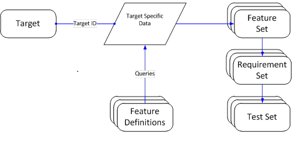

# Tests

Tests map to one or more requirements and are assigned to a specific target (as shown in the following illustration). You can use this mapping to determine which tests are required for each certification submission that you create.

Each test has a pass/fail status, which is the aggregate of all the test results.

When you schedule a test, the outcome (that is, a **TestResult** object) is instantiated.

Test result status is tracked in the following ways:

-   If a test has any passing result, it's marked as **Passed**, and the total passing count is incremented.

-   If a test is both running and waiting to run, it's marked as **Running**, and the running count is incremented.

-   If a test has a failed result, it's marked as **Failed**, and the total failed count is incremented.

-   If a test has not yet run or has been canceled, it's marked as **NotRun**, and the **NotRun** count is incremented.

The **TotalCount** property represents the number of all the tests that are passing, failing, and not yet run. If a test has previous **Running**/**InQueue** results, the results are deleted when a new test starts.

A **TestResult** object is a test outcome. It's instantiated when a test is scheduled. **TestResult** includes information such as start/end time, pass/fail count, logs, and task results. You can schedule a test to run multiple times, and each test pass has its own result.

## Related topics

[Distributing Tests](distributing-tests.md)

[Scheduling Tests](scheduling-tests.md)

[Machine Sets](machine-sets.md)

[Setting Test Parameters](setting-test-parameters.md)

[Running Tests](running-tests.md)

[Exporting Test Results](exporting-test-results.md)

 

 

