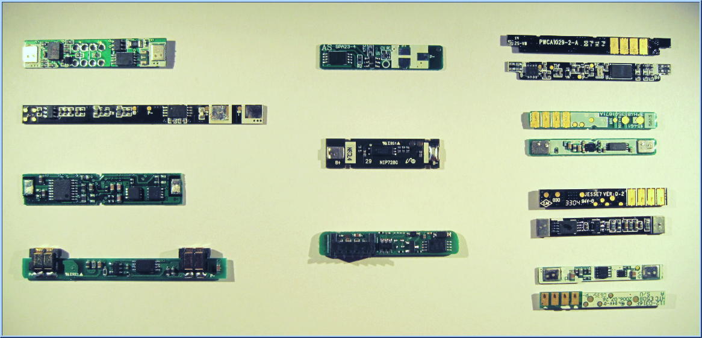
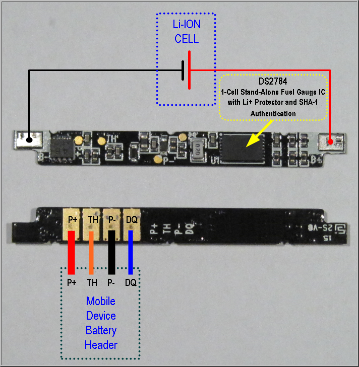
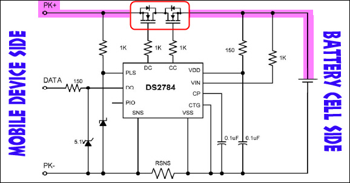
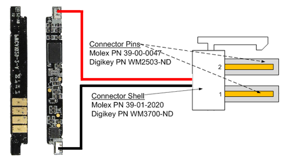
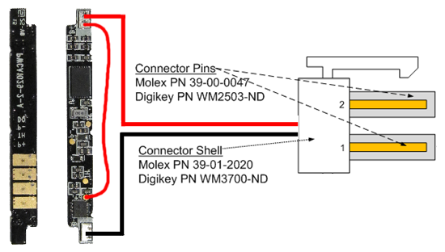
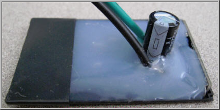
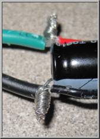
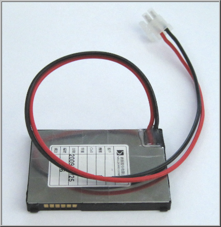
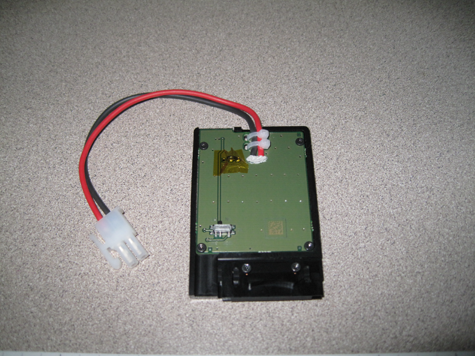

# Battery Blank Information Guide

This guide provides information about the Battery Blank, including its purpose, along with a technical description. This information does not dictate design requirements and should not be used to establish such requirements. Because batteries differ greatly in form, design and function, it would be impractical for Microsoft to provide design requirements. Instead, this information guide should be used to assist in the process of determining how best to construct a battery blank.

1.  **Why do I need a Battery Blank? Can’t I just power my mobile device directly with an external power source?**
    -   A battery blank goes a step further than just direct power to a device by spoofing the elements of an actual battery which are often required by the device to power-on. This enables the device to be used for long-term testing in lab environments that may not normally be possible due to limited battery capacity. This is accomplished by allowing the mobile device to communicate normally with the battery even though current is being supplied by an external power source. In some very limited cases, you *can* get away with directly powering a mobile device from an external power source such as a 4.2vdc power supply. In most cases, however, the device may fail to operate correctly when it can’t communicate with its own battery. The problems you may encounter include: Failure to power-on, failure to boot completely, premature or false low battery alarm, instant shut-down upon boot or many other types of behavior.
2.  **How does a mobile device communicate with its own battery? What is a smart battery?**
    -   Most modern mobile devices communicate with the battery using a one-wire serial interface known as HDQ (see FAQ \#5 for a description of the term HDQ). The on-board battery circuit monitors a voltage drop across a small current sense resistor connected in series with the battery output to determine charge and discharge activity of the battery. Compensations for battery age, temperature, self-discharge, and discharge rate are applied to the capacity measurements to provide available time-to-empty information across a wide range of operating conditions. Available battery capacity is automatically recalibrated, or learned, in the course of a discharge cycle from full to empty. These circuits communicate to the mobile device over an HDQ one-wire or I²C serial interface.
3.  **Does a Battery Blank need to function EXACTLY like a battery? What are the actual requirements?**
    -   The Battery Blank is used only as a means to provide continuous external power to the device to enable long-term testing that would otherwise be impossible using the battery alone. It is not used as an instrument to test the operation or design of the actually battery. For the sake of simplicity, the battery blank should provide only what is normally required to power the phone in the same manner that the battery would. For example, if the device design requires communication with a battery-based HDQ or I²C circuit, then the battery blank should provide that capability. If the battery uses a known or expected resistance for ID, authentication or a thermistor (TH) circuit, the blank should provide that as well. Exactly how the required characteristics to mimic the battery are provided by the battery blank to the device are entirely up to the OEM.
4.  **My battery uses an HDQ or I²C-based Fuel Gauge Circuit and my device requires this circuit to be present to boot-up. What is required to spoof this circuit so the battery blank can be used instead of the battery?**
    -   This is unknown to Microsoft since we didn’t design the circuit. We expect the OEM hardware designers to understand these requirements since they have access to the schematics, design references and hardware specifications that would stipulate these requirements. We rely on these same designers to fabricate the battery blank and ensure it meets both the Chassis specifications and hardware requirements.
5.  **What does the acronym HDQ mean when used in reference to batteries and fuel gauge circuits?**
    -   HDQ is a composite acronym used to describe the one-wire serial communications circuit between the battery and the mobile device. **H** in the acronym means *High-speed*, and **DQ** is a standardized electronics term that describes Data Input (**D**) and Data Output (**Q**) used with many different types of Flip-Flop circuits. Put together, you get *High-speed Data Input / Data Output*, or just *HDQ* for short.
6.  **How difficult is it to make each type of Battery Blank? Are there any construction guidelines?**
    -   This depends on the complexity of the battery circuit used, and only the OEM or its assigned engineers have a complete understanding of the requirements necessary to mimic the original battery. As for the physical construction, there are many possible designs, most of which probably started out as an original battery that had the chemical cell removed leaving only the shell and the battery circuit board behind. In some designs where the battery doesn’t provide I²C or HDQ 1-wire communications, construction may be as simple as routing external wires to the appropriate pads on the phone-side of the battery circuit board. In other cases, you may have to adjust the way your safety circuit operates or even remove it from the circuit. In still other cases, you may have to alter the software on the phone to accommodate the change to the battery. It really just depends on what the device expects to see from the battery to assume a genuine battery is being used instead of the battery blank. More on this specific point will be covered later in this document.
    -   In most cases, removing the battery cell leaves behind a very flimsy and fragile battery frame. Once the wires are attached to the battery board and the required changes to the battery board electronics have been made (if any), we recommend that the blank we potted or filled with a stiff material that restores the rigidity to the plastic frame and makes the battery blank durable. Ideally, the wires would be potted as well, providing strain relief. Providing a battery blank without any strain relief on the wires is strongly discouraged. Batteries that have sheet metal cases are usually rigid enough but may cause other problems with the wires by exposing sharp edges that would cut into the wire insulation. Hot glue is a good option for holding wires and other required parts inside the frame (such as any needed capacitors). Keep in mind when designing your battery blank that it should be durable and able to handle multiple insertion and removal cycles without any damage to the blank. The blank should fit snug into the battery compartment, just like the original battery. It should never be so loose that it would fall out by itself, but it also shouldn’t be too tight. The wires coming out of the battery blank should deflect out and away from the device. There should be no supplemental components protruding from the back of the battery blank that increase its thickness (like large electrolytic capacitors or other electronic components). If capacitors or other large components are required, please consider using surface-mount devices to keep the size down as much as possible. These specific points are covered in more detail later in this document.

## Sample Battery Protection and Communication Circuits

These battery circuits were removed from 11 different types of batteries. The cells to which they were once *permanently* attached have been removed and recycled and are not shown in this exhibit. The circuits showing the metal silver tabs on the left and right edges of the circuit board are where the battery cell connected. The other circuits showing 4 gold contacts are where the device would connect. The pin arrangement can vary greatly from battery-to-battery, but most include a minimum of 3 contacts to a maximum of 6 contacts. The pins usually provide +, -, HDQ, ID or TH, although this varies greatly from OEM to OEM. Some have fuel gauge chips and some don’t. There is no magic done inside the actual battery cell that provides any kind of physical battery characteristics. This information is all fabricated, calculated, measured or guesstimated by the on-board electronics that are factory programmed (if needed) and permanently attached to factory-fresh batteries. These circuits are designed to see some amount of battery cell voltage **100%** of the time for the entire life of the battery cell, even when the battery is technically discharged. Once removed from the battery, all of the information that has been recorded over the life of the attached battery cell can become invalidated or lost by the electronics.

As you can see, there are a wide variety of styles, shapes and circuitry available just inside the battery alone. As such, it would be impractical for Microsoft to dictate the specifics behind what exactly is needed by your device to make the battery blank function correctly, especially in cases where original battery electronics are recycled for use in battery blanks.

In many cases, these circuits also act to authenticate the attached device by communicating with it over the HDQ or I²C interface upon insertion into the device: If the device properly authenticates with the battery, the battery turns-on enabling full output power to the device, thus allowing it to power-up. Additionally, the fuel gauge circuit (if present) communicates with the mobile device over the HDQ (or I²C) one-wire serial interface to relay operational battery characteristics to the mobile device. Using this information, the battery electronics can provide a number of usage characteristics, including approximate battery life remaining, current power consumption, current voltage level, time-to-empty, number of charge cycles, etc. For mobile device batteries, a more common authentication method is to simply provide a fixed resistance from ground through an ID pin that is used by the phone to ensure a genuine battery is attached (as long as the resistance matches). This particular tactic goes both ways, as well – the battery can actually require a fixed resistance in the mobile device before turning on its primary output. Your battery blank should supply any of the needed parameters required to accurately simulate a real battery while allowing the device to be powered from an external power source.

**Warning**  It is very important to remember that the circuits shown above were specifically designed to protect a physical battery cell. Once removed, the operational parameters of that battery cell may be lost or invalidated by the same circuit that communicates with the phone, and the operational information passed back to the phone may reflect that change and cause the device to behave differently. Likewise, the safety circuits normally expecting to see a constant voltage provided by the battery cell would now see voltage being switched on and off through the battery blank, and this could cause the safety circuits to fail or permanently trip which could in turn erroneously open the output of the battery blank during testing (we’ve seen this before). It may be prudent for you to consider bypassing any safety circuitry normally designed to protect a battery cell as these circuits will likely detect the on-and-off power cycles through the battery blank as problems with the battery. These unanticipated failures of the safety circuitry may not necessarily manifest themselves right away, either. The battery blank may appear to function normally from anywhere to 10 to hundreds of power cycles before they trip.

 

## Designing a Battery Blank – An example

A large number of single-chip solutions that combine specially-designed battery protection electronics with the ability to trigger external FETs are currently available and are becoming more pervasive in the marketplace. The use of these electronics in battery blanks can occasionally cause more harm than good since they are being used outside of their designed intent and specifications and can therefore erroneously (and often unexpectedly) cause the output to open.

*Since the OEM has the required confidential information (i.e., schematics and design specifications) needed to determine how best to bypass these safety circuits, we rely on them to provide any needed modifications to the battery blanks.*

The following information is provided as a generalized example of how to construct a battery blank. It shows the evolution from what at first appears to be a good solution to what ultimately had to be changed to make the battery blank robust and reliable for use in the lab.

In the above picture, the OEM has elected to use the Dallas/Maxim DS2784, a popular single-cell, stand-alone fuel gauge IC. The fuel gauge provides accurate estimates of remaining capacity and reports timely voltage, temperature, and current-measurement data. Capacity estimates are calculated from a piecewise-linear model of the battery performance over load and temperature, and system parameters for full and empty conditions. The algorithm parameters are user programmable and can be modified in pack. ***Critical capacity and aging data are periodically saved to EEPROM in case of loss of power due to a short circuit or deep depletion.***

That last bolded text is very important, since it indicates that this part is specifically designed to handle scenarios where the battery enters deep depletion, a characteristic somewhat matched by switching the power off to a battery blank. While comforting at first glance, the real-world application is far less obvious. The Typical Operating Circuit provided by the DS2784 Datasheet shows that the chip controls a dual-FET arrangement placed in series with POSITIVE lead to the device designed to interrupt the output as deemed appropriate by the DS2784:

**TYPICAL OPERATING CIRCUIT SCHEMATIC**

The quick and easy way to make a Battery Blank in this case might first appear to be as simple as replacing the physical battery cell with the required Molex connector:

By simply replacing the battery cell with the Molex connector, you leave the FETs in series with the POSITIVE. The safety circuit is still intact and fully operational. Any error condition detected by the DS2784 could cause the FETs to trigger OPEN, even under normal operational test conditions. The DS2784 assumes a battery cell is connected, not an external power source, and proper operation of the DS2784 per its original design specification is no longer guaranteed. There are countless conditions that could cause a malfunction in this unnatural application of the DS2784, but ultimately the end result is that the Battery Blank stops working and power stops flowing to the mobile device.

There are a number of workarounds possible, but ultimately the designers of the battery and battery interface need to determine the best solution. In this particular example, the device explicitly requires the HDQ circuit to be connected to the phone. That means that simply bypassing the DS2784 entirely wouldn’t work as it needs power itself to provide the required communications to the mobile device. That leaves several possible options:

1.  *Disable the need for HDQ in the device through a software change and hardwire a bypass around the FET.*
    -   This option requires a software workaround coupled with a hardware change and is not ideal, especially if part of the device testing covers communications with the battery.
    -   This is probably the least ideal option as it could lead to the discovery of non-real-world bugs and might also precipitate additional software problems in the device relating to charging or power management.
2.  *Design your device to use HDQ if present but build-in an option to bypass this requirement if another operational parameter is met such as a fixed resistance to ground in place of HDQ.*
    -   This solution is very ideal but requires additional development and implementation during the hardware development cycle which may be too late at this point or simply not an option to begin with.
    -   The idea here is that if a battery blank doesn’t provide HDQ signaling because it has been removed from the blank that something else has been added (such as a fixed resistance) to trigger an HDQ requirement over-ride in the device allowing the device to operate normally as though the HDQ signal was present.
3.  *Bypass only the FET so even if it does attempt to open, power will still flow to the P+ contact.*
    -   This option doesn’t cover the changes or error conditions that the DS2784 might be reporting to the phone over the HDQ line which could still negatively impact operation of the device.
    -   Unless the DS2784 is sending information over HDQ to the phone that impacts its operation, this is probably the best and easiest solution to implement.

Assuming Option \#3 is ideal in this particular example, we only need to find a way to bypass the FET while leaving the DS2784 intact to do its thing. On some battery board designs where schematics and layout diagrams are not available, you may have to use a multi-meter to identify the direct wire to the P+ pad on the device-side of the battery board. In other cases, silk-screening may point you directly to the answer:

A P+ Test Pad is conveniently located on the component-side of the battery board. All that is required now is to bridge positive voltage being provided to B+ to this P+ Test Pad as well. This will provide voltage to the DS2784 allowing it to operate normally while also bypassing the FET if it should attempt to open.

The end result after modifying the battery board with a short around the FET:

Keep in mind that this was only an example using a popular Battery Management part. Every design is different, and the solution described above is only one possible example designed to make you think about the potential problems you may encounter in designing or building a battery blank. This represents one of the more complex examples seen in the field. For batteries that provide only a single-chip safety circuit that controls a FET, the solution is usually very simple: Just bypass the FET. No need to worry about sour grapes from the HDQ line because it doesn’t exist. It is also important to note that the majority of safety interrupt circuits observed in the field actually interrupt the NEGATIVE lead, not the positive lead as used by the DS2784. The same bypass principles apply, however.

## Building for Durability – Recommendation, Do’s and Don’ts

As previously mentioned, once you peel away the labels and very carefully remove the chemical battery cell from a production battery, you’re usually left with a flimsy, thin, open plastic frame. Not a picture of durability by any means, so in this section, we’ll cover some recommendations that might guide you down a more rigid and durable path.

It is important to remember that you’re building a battery blank for use in a lab environment. As such, it needs to be durable and able to resist excessive and often unreasonable working conditions. Although personnel are trained not to use the wires as a means to remove the battery blank, some people do so without thinking about it.

**Potting**

Although not listed as a specific requirement in the Chassis specification, your battery blank should closely approximate the designed durability of the production battery. There are a number of ways to do that. Most include potting (or filling) the entire empty cavity with epoxy, hot glue, silicon adhesive, rubber sheet or a plastic filler of some type. Whatever option you ultimately choose, try to build your blank in such a way that access to the actual battery board itself isn’t permanently blocked. The reason for this request is that if you did have a problem with the design of your blank and it failed for some reason, it is nearly impossible to clear epoxy off the battery board without damaging the circuitry which would seriously inhibit any troubleshooting efforts. In this case, the OEM would be requested to provide fresh, working blanks to replace the ones that couldn’t be repaired. Suggestions for this include adding a layer of Kapton tape between the battery board and the potting compound, or using a potting compound such as hot glue that can be cooled and fractured away from the battery board without damage to the components.

Some examples of Potting materials and compounds:

-   **Air (i.e., no potting)**

    -   Advantages

        -   None

    -   Disadvantages

        -   No strain relief for the wires connected to the battery board
        -   Nothing to fill the flimsy plastic frame
        -   Nothing to secure the battery board in place
        -   Nothing to protect the interior electronics

-   **Hot Glue**

    -   Advantages

        -   Many different kinds available to cover most scenarios
        -   Hot glue sticks are cheap
        -   Easy to apply – heat and squirt, no mixing required
        -   Usually easy to clean off unwanted residues
        -   Doesn’t chemically bond with anything else

    -   Disadvantages

        -   Can make a terrific mess if not carefully contained
        -   Can easily and quickly burn the assembler
        -   Can take anywhere from 2 minutes to 2 hours to solidify
        -   Heat from the glue could soften and distort the thin, plastic frame

-   **Epoxy**

    -   Advantages

        -   Very dense material; extremely rigid when properly mixed and cured
        -   Can be drilled or easily shaped as needed once cured
        -   Comes in hand-mixable putties that work very well for this application and avoid some of the pitfalls associated with liquid-based, two-part epoxy mixes

    -   Disadvantages

        -   Can chemically bond to certain other materials making removal extremely difficult
        -   Exothermic reaction when curing can release considerable heat that could soften and distort the thin, plastic frame
        -   Two-part liquids usually fill every void possible as it thins considerably just before hardening
        -   Take anywhere from 1 minute to 1 day to cure depending on the formula
        -   Very tedious to remove if needed. Will usually damage the enclosure during the removal

-   **Other Solid Filler Materials: Rubber, Plastic, Wood, Solid Cardboard**

    -   Advantages

        -   Easily removable if needed
        -   Generally holds shape well if cut precisely to fit case

    -   Disadvantages

        -   Can be tedious to cut depending on material
        -   Can be hard to anchor wires to for strain relief purposes
        -   Doesn’t usually stick to the plastic frame and may require a tape wrap or other adhesive to hold the material in place inside the frame

**Good and Bad Implementations**

Some Battery Blanks require supplemental components such as capacitors to be placed within the battery frame. If needed (as determined by the OEM), these parts should fit entirely inside the battery cavity of the battery frame. Any protrusions other than the wires leading to the Molex connector could negatively impact overall device thickness and may hinder our ability to place the device into one of our automated testing instruments.

Here is an example of a poorly designed Battery Blank:

The 2200uF capacitor shown above increased the thickness of the device by more than 13mm. In this case, laying the electrolytic capacitor on its side or using surface-mount tantalum capacitors instead of the style shown would have significantly reduced or even completely eliminated the extra thickness. Also note the lack of any reasonable strain relief on the wires. Even a small tug on a wire could pull it out of the hot glue or loosen it. We also discovered that the wiring hidden inside the sea of hot glue wasn’t soldered together, it was only twisted creating a very unreliable electrical connection (see detail picture above right).

Here are examples of a well-designed Battery Blank:

On the right below note the secure connections to the cable and materials used ensuring a good fit to the device.

On the left above, Note the uniform thickness throughout the battery. Sheet metal holds the frame together on top and bottom and keeps the entire assembly rigid. The area where the wires protrude is sealed with hot glue to provide solid strain relief and to keep the wires from being cut by the edge of the sheet metal. Electronically, the safety FET has been removed and replaced with solid wire. This is a solid, well-thought-out Battery Blank implementation that very closely mimics the original OEM battery.

## Safety Considerations, General Guidelines and Warnings

There are 2 ways to create Battery Blanks:

1.  **From Scratch:** Microsoft strongly recommends that an OEM create their Battery Blanks from scratch to avoid the potential dangers and pitfalls associated with transforming actual device batteries into Battery Blanks. Doing so has been proven to generate safe, reliable Battery Blanks that are as durable and reliable as a production battery.
2.  **Modifying Existing Batteries:** Microsoft strongly recommends building the Battery Blank from scratch, however if the OEM does choose to transform existing batteries into battery blanks, please read the following section in its entirety.

**Note**  The information provided below is not inclusive of all of the potential dangers associated the disassembly of a sealed battery unit. Each battery design is different and will likely require a different disassembly method.

 

The general process is disassembly begins with careful removal of the labels on the battery. When removing the label(s), take care not to puncture or scratch the side of the battery cell with your tools.

Once the labels are removed, the cell is generally spot-welded to an in-line Polyfuse and then soldered (or spot welded) to the actual battery circuit board. When disconnecting the battery cell from the battery board, cut only 1 wire at a time and take extra measures to keep the wires from shorting together. Any short at this point could permanently damage the Battery Protection Circuitry that your device may require to function normally – you could easily Brick your Battery Blank.

Once the cells are removed from the battery frame, properly dispose of the cells. LiPol and Li-ION cells do NOT go in the regular trash and must be properly recycled. Most Office Supply Stores have battery recycling centers.

-   *If at any time you witness a battery starting to balloon or swell up, discontinue the disassembly process immediately and verify that there are no shorts on the battery. Deal with this problem completely before continuing. Observe it in a safe place away from any combustible materials for at least 20 minutes.*
-   *When removing the wires (flat or round) from the battery cell, NEVER peel the spot-welded wires off the actual battery cell. Doing so may breach the wall of the cell causing the materials inside the cell to ignite.*
-   *Any battery cell that has been shorted or punctured may leak and spontaneously ignite. In the event of a puncture or breach, remove the battery for observation and place in a safe, open area away from any combustible material for approximately 20 minutes.*
-   *Batteries should remain at room temperature during the entire disassembly procedure. Cells that get warm or hot during removal usually indicate a short circuit which could ultimately cause an explosion and possible spontaneous ignition of the battery chemicals. **Always keep track of the exposed battery cells.***
-   *Never store battery cells in areas with extreme temperatures and make sure they don’t short-out to each other in the storage container.*
-   *Properly dispose of battery cells as soon as possible – do not collect them for several weeks.*
-   *Insulate the Positive plate of a battery cell with a durable material such as Kapton tape to prevent the cell from shorting out.*
-   ***Never, under any circumstance, attempt to disassemble a sealed battery cell. It will ignite and start an uncontrollable, chemical fire as the Lithium metal reacts with oxygen and moisture in the air. Water will not extinguish a chemical fire of this type and will only cause a much more violent reaction. Have appropriate fire control equipment on hand and ready to use. Remember that metal fires (lithium batteries) require uncommon Class D fire extinguishers which are specifically designed to smother burning metal fires.***

 

 

