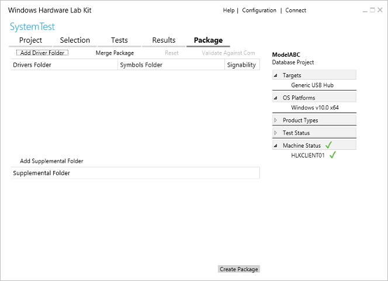

# Step 8: Create a submission package

**Note**  We highly encourage you to include driver symbols as part of package creation. Including symbols enables Microsoft to triage and root cause issues related to your driver.

 

After the device passes all of the necessary tests, you can create a submission package (.hlkx file) for submission.

Windows HLK Studio supports package creation, so you don't need to use a separate submission tool. It supports adding resource files (drivers, symbols, errata) necessary to complete certification. You can also merge multiple packages (.hlkx files) into one single package.

The following image shows the HLK Studio **Package** tab.

## To create a submission package

1.  Select the **Package** tab.

2.  If you used a special driver for a device (optional), submit it by doing this:

    1.  Click **Add Driver Folder** &gt; **Browse** to select the folder, and then click **OK**.

    2.  In the **Driver Properties** dialog box, select the appropriate **Products** and **Locales**, and then click **OK**.

        **Important**  The default locale is English only. If you want to add another locale, you must add it now. After the driver package is created, you cannot change the locales.

         

3.  To add symbols (optional), right-click the driver folder, click **Add Symbols** &gt; **Browse** to select the folder, and then click **OK**.

4.  To add a supplemental folder (optional), such as a Readme file, contingency message, errata, or manual filter, click **Add Supplemental Folder** &gt; **Browse** to select the folder, and then click **OK**.

5.  Click **Create Package**.

6.  From the **Signing Options** dialog box, select one of these options:

    **Important**  
    All submissions must be digitally signed.

    Starting with Windows 10, you must also include an EV (extended validation) code signing certificate.

     

    -   **Do not sign** to create an unsigned package, for example, to send to Support for debugging or to later merge with other packages into a single submission package.

    -   **Use the certificate store** to create a digitally signed package—the most common scenario. This option requires an X509 certificate—for example a VeriSign certificate— to be installed on the computer running Windows HLK Studio. From the **Windows Security** dialog box, select the appropriate code signing certificate.

    -   **Use a certificate file** to create a digitally signed package by using a portable security file. This option asks you for an X509 certificate file (.cer file).

For additional information on packages, see the following topics:

-   [HLK Studio - Package Tab](p_hlk.hlk_studio___package_tab)

-   [HLK Signing with an HSM](p_hlk.hlk_signing_with_an_hsm)

### Next steps

Congratulations, you have completed the end to end testing of your device using the Windows HLK. Submit the signed package (.hlkx file) through the Hardware Dashboard on the Windows Dev Center. For more details, see [Dashboard Help](http://go.microsoft.com/fwlink/?LinkId=236060) in the Windows Dev Center.

 

 

[Send comments about this topic to Microsoft](mailto:wsddocfb@microsoft.com?subject=Documentation%20feedback%20%5Bp_sxs_hlk\p_sxs_hlk%5D:%20Step%208:%20Create%20a%20submission%20package%20%20RELEASE:%20%288/1/2017%29&body=%0A%0APRIVACY%20STATEMENT%0A%0AWe%20use%20your%20feedback%20to%20improve%20the%20documentation.%20We%20don't%20use%20your%20email%20address%20for%20any%20other%20purpose,%20and%20we'll%20remove%20your%20email%20address%20from%20our%20system%20after%20the%20issue%20that%20you're%20reporting%20is%20fixed.%20While%20we're%20working%20to%20fix%20this%20issue,%20we%20might%20send%20you%20an%20email%20message%20to%20ask%20for%20more%20info.%20Later,%20we%20might%20also%20send%20you%20an%20email%20message%20to%20let%20you%20know%20that%20we've%20addressed%20your%20feedback.%0A%0AFor%20more%20info%20about%20Microsoft's%20privacy%20policy,%20see%20http://privacy.microsoft.com/en-us/default.aspx. "Send comments about this topic to Microsoft")

