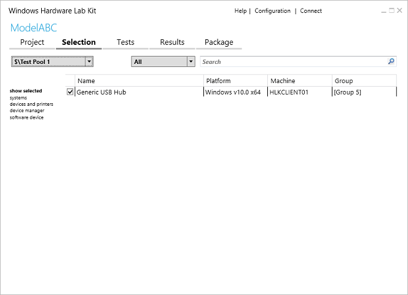

# Step 6: Select target to test

Windows HLK Studio detects all features that a device implements. An individually testable feature is called a *target*. A device may contain multiple targets, represented by one or more hardware IDs. On the **Selection** tab, you can filter what you want to test by using the following views:

-   **systems** - used to test a complete client or server system.

-   **devices and printers** - used to test an external device that's connected to a test system. This device typically appears in **Start** &gt; **Devices and Printers** on the test system.

-   **device manager** - used to test a component of a test system or external device, for example, a network card. This is the most detailed view.

-   **software device** - used to test filter drivers, firewalls, and antivirus software installed on the test system.

    **Note**  Some software drivers are associated with a physical device. If you cannot find your driver listed in the **software device** view, use the search bar in the **device manager** view to find the device under which your software driver is associated.

     

The following image shows the Studio **Selection** tab.

## Select a target to test

1.  In Windows HLK Studio, choose the **Selection** tab. In the machine pool dropdown, choose the pool that contains the devices that you want to test.

2.  In the left pane, select the view based on the device you want to test: **systems, device and printers, device manager,** or **software device**.

    A list of available targets is displayed in the center pane. If you select the **device manager** view, you can choose to show inbox and hidden features.

3.  In the center pane, check the box next to each target that you want to test.

    **Note**  You must select all of the features of a specific product type for a device to receive certification.

     

    **Note**  If you're testing a Web Services on Devices (WSD) device, there may be a delay before the required WSD targets are listed.

     

The **show selected** view in the left pane displays the targets that you've selected across all views. This view allows you to see just the areas you're testing. You also can filter a machine pool by category by using the **category** list. You can search for specific targets and features by using the search box.

To learn more about the different options on this page see [HLK Studio - Selection Tab](p_hlk.hlk_studio___selection_tab).

 

 

[Send comments about this topic to Microsoft](mailto:wsddocfb@microsoft.com?subject=Documentation%20feedback%20%5Bp_sxs_hlk\p_sxs_hlk%5D:%20Step%206:%20Select%20target%20to%20test%20%20RELEASE:%20%287/11/2017%29&body=%0A%0APRIVACY%20STATEMENT%0A%0AWe%20use%20your%20feedback%20to%20improve%20the%20documentation.%20We%20don't%20use%20your%20email%20address%20for%20any%20other%20purpose,%20and%20we'll%20remove%20your%20email%20address%20from%20our%20system%20after%20the%20issue%20that%20you're%20reporting%20is%20fixed.%20While%20we're%20working%20to%20fix%20this%20issue,%20we%20might%20send%20you%20an%20email%20message%20to%20ask%20for%20more%20info.%20Later,%20we%20might%20also%20send%20you%20an%20email%20message%20to%20let%20you%20know%20that%20we've%20addressed%20your%20feedback.%0A%0AFor%20more%20info%20about%20Microsoft's%20privacy%20policy,%20see%20http://privacy.microsoft.com/en-us/default.aspx. "Send comments about this topic to Microsoft")

