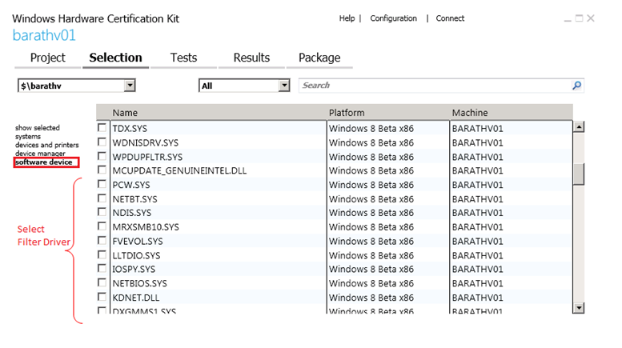

# NDISTest 6.5 - LWF Logo test

This automated test targets LWF by validating that the all the requirements specified for the light weight filter driver are satisfied, and that they comply with NDIS specification on MSDN.

The test installs two of the NDISTest virtual miniports - “NDISTest 6.30 - CL - Default w/TCPIP”, which would be used as the test and support adapters for running the LWF logo test. These virtual miniports are uninstalled in the cleanup phase of the test.

Windows 8 has a requirement that all NDIS LWF drivers are NDIS 6.30. This is validated by ConfigCheck test, which will fail the filter logo test if the Filter driver is not NDIS 6.30.

ConfigCheck test also validates that the Filter driver selected as the target, is actually bound to the test adapter, and an error is thrown if the filter is not bound to the test adapter.

It is also validated that the filter driver is able to process packets that are larger than miniport's MTU size.

This also runs a filter stress test which is designed to stress the datapath and PnP paths of NDIS filter drivers.  The test will limit the test virtual miniport's receive descriptors such that a significant number of receive indications will happen with the receive resources flag.  This test performs the following actions in a multi-threaded way:

-   Stress traffic from the support miniport directed to the test miniport

-   Stress traffic from the test miniport directed to the support miniport

-   Stop/start the test miniport (which triggers a pause and subsequent restart operations)

-   Test adapter indicating media disconnected/connected

-   Test adapter resetting

Finally, basic send and receive connectivity will be tested between the test/support adapters.

## Test details

<table>
<colgroup>
<col width="50%" />
<col width="50%" />
</colgroup>
<tbody>
<tr class="odd">
<td><strong>Specifications</strong></td>
<td><ul>
<li>Filter.Driver.Network.LWF.Base</li>
<li>Filter.Driver.Network.LWF.MTUSize</li>
</ul></td>
</tr>
<tr class="even">
<td><strong>Platforms</strong></td>
<td></td>
</tr>
<tr class="odd">
<td><strong>Expected run time (in minutes)</strong></td>
<td>120</td>
</tr>
<tr class="even">
<td><strong>Category</strong></td>
<td>Development</td>
</tr>
<tr class="odd">
<td><strong>Timeout (in minutes)</strong></td>
<td>120</td>
</tr>
<tr class="even">
<td><strong>Requires reboot</strong></td>
<td>false</td>
</tr>
<tr class="odd">
<td><strong>Requires special configuration</strong></td>
<td>false</td>
</tr>
<tr class="even">
<td><strong>Type</strong></td>
<td>automatic</td>
</tr>
</tbody>
</table>

 

## Additional documentation

Tests in this feature area might have additional documentation, including prerequisites, setup, and troubleshooting information, that can be found in the following topic(s):

-   [Filter.Driver additional documentation](filter-driver-additional-documentation.md)

## Running the test

Before you run the test, you need to manually install your filter driver on the test machine.

Follow these steps to run the test:

1.  Configure the HLK Server and HLK Client machines. Filter Logo tests need just the one client machine.

2.  Install the Light Weight Filter driver on the Client machine.

3.  Restart the Client machine.

4.  From the HLK Server, add the client on which the LWF is installed to a new machine pool, and change the machine status to ‘Ready’.

5.  From HLK studio, create a new project under the **Project** tab in HLK Studio.

6.  In the **Selection** tab of the HLK studio, select the machine pool that was created in the previous steps from the dropdown.

7.  Select **software device**, and select the LightWeightFilter driver that was installed and needs to be tested (see the following figure).

    

8.  Run all of the tests listed in the **Tests** tab against the filter driver.

## Troubleshooting

For generic troubleshooting of HLK test failures, see [Troubleshooting Windows HLK Test Failures](..\user\troubleshooting-windows-hlk-test-failures.md).

For troubleshooting information, see [Troubleshooting the Windows HLK Environment](p_hlk.troubleshooting_the_windows_hlk_environment).

## More information

### Parameters

| Parameter name         | Parameter description                        |
|------------------------|----------------------------------------------|
| **TestAdapter**        |                                              |
| **SupportAdapter**     |                                              |
| **TestScript**         |                                              |
| **queryFilterService** | ServiceName of the filter selected as target |

 

 

 

