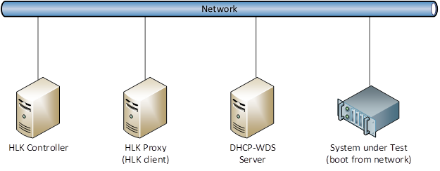
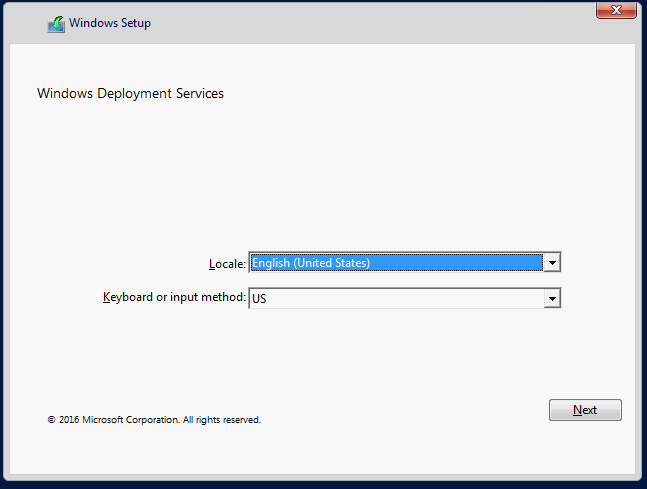

# <span id="p_hlk_test.b0ea1e01-f036-4a87-9b8d-bae338e56086"></span>SecureBootUEFIOverPXE


This manual test validates whether a test computer is capable of booting from the network in Secure Boot mode.

## Test details
|||
|---|---|
| **Specifications**  | <ul><li>System.Server.AzureStack.Security.SecureBootUEFIOverPXE</li></ul> |  
| **Platforms**   | <ul><li>Windows Server 2016 (x64)</li></ul> |
| **Supported Releases** | <ul><li>Windows 10</li><li>Windows 10, version 1511</li><li>Windows 10, version 1607</li><li>Windows 10, version 1703</li><li>Windows 10, version 1709</li></ul> |
|**Expected run time (in minutes)**| 60 |
|**Category**| Scenario |
|**Timeout (in minutes)**| 3600 |
|**Requires reboot**| false |
|**Requires special configuration**| false |
|**Type**| automatic |

 

## <span id="Additional_documentation"></span><span id="additional_documentation"></span><span id="ADDITIONAL_DOCUMENTATION"></span>Additional documentation


Tests in this feature area might have additional documentation, including prerequisites, setup, and troubleshooting information, that can be found in the following topic(s):

-   [System.Server additional documentation](system-server-additional-documentation.md)

## <span id="Running_the_test"></span><span id="running_the_test"></span><span id="RUNNING_THE_TEST"></span>Running the test


### <span id="Hardware_requirements"></span><span id="hardware_requirements"></span><span id="HARDWARE_REQUIREMENTS"></span>**Hardware requirements**

The following hardware is required for testing Secure Boot over PXE:

-   A server that is running HLK controller and a test computer to act as the HLK proxy. Refer to Windows HLK prerequisites for more details.
-   A System under Test (SUT) server that meets the following requirements.

    -   You must configure the server according to the SecureBootUEFI test, and the server must pass the test.
    -   The server must have a network adapter installed that is capable of PXE boot.
    -   You must configure the server’s BIOS settings to allow boot from the network using the network adapter.

-   One or two servers on the network to run DHCP and Windows Deployment Services (WDS).
-   You must connect all computers to the same physical network.

The following diagram shows how to configure your hardware for Secure Boot over PXE testing.



### <span id="Software_requirements"></span><span id="software_requirements"></span><span id="SOFTWARE_REQUIREMENTS"></span>**Software requirements**

The following software is required for testing Secure Boot over PXE.

-   The latest version of Windows HLK.
-   Windows Server 2016 installation media or ISO file.

### <span id="Test_execution"></span><span id="test_execution"></span><span id="TEST_EXECUTION"></span>**Test execution**

1.  Ensure that DHCP server is running on the DHCP-WDS server (or a separate DHCP server) and has an active DHCP scope for the network with available IP addresses.
2.  Ensure that Windows Deployment Services (WDS) is installed on the DHCP-WDS server (or a separate WDS server).
3.  On the WDS server, do the following:

    1.  Open the Windows Deployment Services console. Expand **Servers &gt; Server Name**. Right-click **Boot Images**, and then click **Add Boot Image**.
    2.  In the **Add Image Wizard**, browse to the location of the Windows Server installation media in *X*:\\sources\\boot.wim, where *X* is the drive letter of the DVD or mounted ISO image. Accept all default values.
    3.  Right-click the WDS server, and then click **Properties**.
    4.  On the **PXE Response** tab, click **Respond to all client computers (known and unknown)**.
    5.  On the **Boot** tab, click **Always continue PXE boot** under both **Known clients** and **Unknown clients**.
    6.  On the **DHCP** tab, if the DHCP server is installed on the same computer, select both check boxes.

4.  Restart the System under Test (SUT) computer and force it to boot from PXE. Typically, you can press **F12** during the POST stage of server boot. However, this may differ depending on the hardware manufacturer.
5.  Monitor the progress on the client computer. A successful boot should display a **Windows Setup** screen with a **Windows Deployment Services** message.

    

6.  Press **Shift+F10** to display the command prompt, and then type the following command:

    ``` syntax
    reg query HKLM\System\CurrentControlSet\Control\SecureBoot\State
    ```

    The registry value **UEFISecureBootEnabled** will be displayed. The expected value data is **0x1**.

7.  When you get the positive test results, you can run the HLK test against the HLK proxy (HLK client) test computer. You will be prompted to manually confirm that the test completed successfully.

## <span id="More_information"></span><span id="more_information"></span><span id="MORE_INFORMATION"></span>More information


### <span id="Parameters"></span><span id="parameters"></span><span id="PARAMETERS"></span>Parameters

| Parameter name  | Parameter description                       |
|-----------------|---------------------------------------------|
| **HasVerified** | Enter YES if you have verified the scenario |

 

## <span id="Troubleshooting"></span><span id="troubleshooting"></span><span id="TROUBLESHOOTING"></span>Troubleshooting


For generic troubleshooting of HLK test failures, see [Troubleshooting Windows HLK Test Failures](..\user\troubleshooting-windows-hlk-test-failures.md).

 

 


