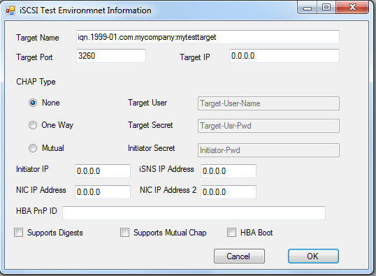

# iSCSI HBA Boot Test (LOGO)

This test verifies that the host-bus adapter (HBA) properly reports the presence of a boot session to the Microsoft iSCSI initiator service.

## Test details

<table>
<colgroup>
<col width="50%" />
<col width="50%" />
</colgroup>
<tbody>
<tr class="odd">
<td><strong>Specifications</strong></td>
<td><ul>
<li>Device.Storage.Controller.Iscsi.Interface</li>
</ul></td>
</tr>
<tr class="even">
<td><strong>Platforms</strong></td>
<td><ul>
<li>Windows Server 2016 x64</li>
</ul></td>
</tr>
<tr class="odd">
<td><strong>Supported Releases</strong></td>
<td><ul>
<li>Windows 10</li>
<li>Windows 10, version 1511</li>
<li>Windows 10, version 1607</li>
<li>Windows 10, version 1703</li>
</ul></td>
</tr>
<tr class="even">
<td><strong>Expected run time (in minutes)</strong></td>
<td>10</td>
</tr>
<tr class="odd">
<td><strong>Category</strong></td>
<td>Development</td>
</tr>
<tr class="even">
<td><strong>Timeout (in minutes)</strong></td>
<td>600</td>
</tr>
<tr class="odd">
<td><strong>Requires reboot</strong></td>
<td>false</td>
</tr>
<tr class="even">
<td><strong>Requires special configuration</strong></td>
<td>true</td>
</tr>
<tr class="odd">
<td><strong>Type</strong></td>
<td>automatic</td>
</tr>
</tbody>
</table>

 

## Additional documentation

Tests in this feature area might have additional documentation, including prerequisites, setup, and troubleshooting information, that can be found in the following topic(s):

-   [Device.Storage additional documentation](device-storage-additional-documentation.md)

## Running the test

Before you run the test, complete the test setup as described in the test requirements: [iSCSI Boot Component Testing Prerequisites](iscsi-boot-component-testing-prerequisites.md).

In addition, complete the following steps:

1.  Install the operating system on a target disk device.

2.  Run the test as an HLK Studio job from the Device Console window.

3.  Enter the required data in the configuration dialog box that appears when this job is scheduled.

This test is run in an iSCSI test environment.

If this is the first time you are running an iSCSI HBA test, iSCSI Target test, or MPIO test over iSCSI bus type on the HLK client, or if there is no iscsihctconfig.ini under \[HLK Path\]\\JobsWorkingDir\\ on the HLK client, you will receive the following pop-up dialog box to input iSCSI configuration information and/or HBA information:

Follow these steps to enter the information:

1.  Type the target IQN, portal, and port information into **Target Name**, **Target IP**, and **Target Port**.

2.  Select the **CHAP Type** and type the user name and password into **Target User**, **Target Secret** and **Initiator Secret**, if **Mutual** is selected.

3.  If you select **Mutual** for **CHAP Type**, select the **Supports Mutual Chap** check-box.

4.  If there are multiple initiator IP addresses, enter the one used for the test in **Initiator IP**.

5.  If the test is for the iSCSI Target test, type the iSNS server IP address in the **iSNS IP Address** field, and type the **NIC IP address** into the **NIC IP Address** field.

6.  If the target support Digests, select the **Supports Digests** check-box.

7.  The **iSNS server IP address** and **NIC IP address** will not be used by the MPIO Test. But since the test environment is set up to run both MPIO test and iSCSI Target tests, fill out this field. The same iscsihctconfig.ini will be used for all on the same test environment.

8.  If the test is for the iSCSI HBA test, type the two NIC IP addresses into **NIC IP Address** and **NIC IP Address 2**. These fields are the same as those in WLK 1.6 used by the iSCSI HBA Redirection Test. Also, type the HBA port device instance path into **HBA PnP ID**. If the HBA port instance is configured to support digests, please select the **Supports Digests** check-box. If HBA port instance is configured to support boot, check the **HBA Boot** check-box.

9.  Click **OK**.

This information will be saved into the iscsihctconfig.ini file. There is a copy of the iscsihctconfig.ini file under \[HLK Path\]\\JobsWorkingDir\\. It enables users not to input the configuration information for every iSCSI test on same test environment, so the iSCSI UI will not pop up every time after the first input. To change the iSCSI configuration information, change the iscsihctconfig.ini file under \[HLK Path\]\\JobsWorkingDir\\ directly or delete it to cause the UI to pop up again.

## Troubleshooting

For generic troubleshooting of HLK test failures, see [Troubleshooting Windows HLK Test Failures](..\user\troubleshooting-windows-hlk-test-failures.md).

For troubleshooting information, see: [Troubleshooting Device.Storage Testing](troubleshooting-devicestorage-testing.md).

If you experience issues during this test, complete the following steps:

1.  From the Windows HLK Manager, review the test job results log file for test failures.

2.  Check if the target has a drive letter.

3.  Verify the data entered in the configuration dialog (popup dialog box when the job is scheduled from device console).

## More information

This test performs the following algorithm:

1.  Determines the current system boot drive.

2.  Retrieves the currently active iSCSI sessions on the system by using the ISCSI\_SessionStaticInfo Microsoft Windows Management Instrumentation (WMI) class.

3.  For every active iSCSI session that is found:

    1.  Checks the Type field of the session class to determine if it is a boot session.

    2.  If the iSCSI session is a boot session, determines the drive letter that is associated with that session.

    3.  If the associated drive letter matches the system boot drive letter, starts the system from the iSCSI device.

### Command syntax

<table>
<colgroup>
<col width="50%" />
<col width="50%" />
</colgroup>
<thead>
<tr class="header">
<th>Command option</th>
<th>Description</th>
</tr>
</thead>
<tbody>
<tr class="odd">
<td>
Iscsi_boot_test.exe
</td>
<td>
Runs the test.
</td>
</tr>
</tbody>
</table>

 

>[!NOTE]
>  
For command-line help for this test binary, type `/h`.

 

### File list

<table>
<colgroup>
<col width="50%" />
<col width="50%" />
</colgroup>
<thead>
<tr class="header">
<th>File</th>
<th>Location</th>
</tr>
</thead>
<tbody>
<tr class="odd">
<td>
Iscsi_boot_test.exe
</td>
<td>
<em>&lt;[testbinroot]&gt;</em>nttest\driverstest\storage\wdk\iscsi\
</td>
</tr>
</tbody>
</table>

 

### Parameters

| Parameter name         | Parameter description                      |
|------------------------|--------------------------------------------|
| **LLU\_NetAccessOnly** | User account for accessing test fileshare. |
| **LLU\_LclAdminUsr**   | User account for running the test.         |

 

 

 

