# IPsec Task Offload v2 Test

The procedures presented in this section outline the process for testing your IPsec Task Offload v2 for proper functionality with the Microsoft Windows operating system. These procedures use the Microsoft Windows Logo Kit (WLK) and Windows Hardware Lab Kit (Windows HLK). To ensure full functionality, you must run all of the tests that the Windows HLK identifies as required for the device.

IPsec Tov2 logo tests use SupportDevice0 on support machine and test target on the test machine. Thus both these network adapters need IPsec Tov2 capability. Building on top of 'Running the LAN tests in the HCK' as described in section 8 of this document, the following steps demonstrate how to run IPsec Tov2 logo tests:

1.  In the HLK studio, create a new project under the **Project** tab.

2.  In the **Selection** tab of the HLK studio, select the machine pool in which the test machine is located.

3.  Select **Device Manager**, and select the network adapter on which the tests are to be run.

    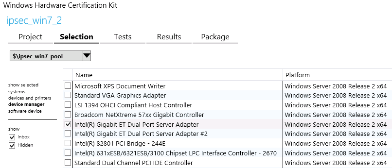

4.  In the Tests tab the **IPsec Tov2 Logo Test** will appear. Select the test and choose **Run Selected** (found near the top).

    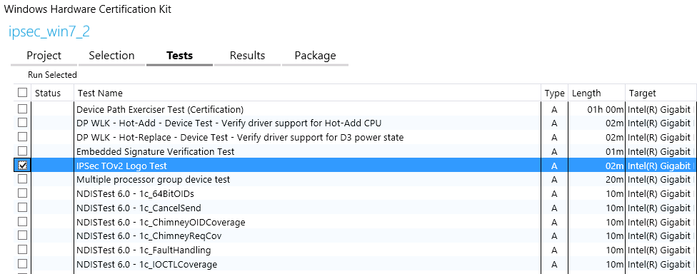

5.  The **Machine Set** dialog box will show up. Select Client and Support machines using the drop down box. Client will be selected by default, but the checkbox needs to be selected for the support machine. The tests will start after clicking **ok** on the dialog box.

    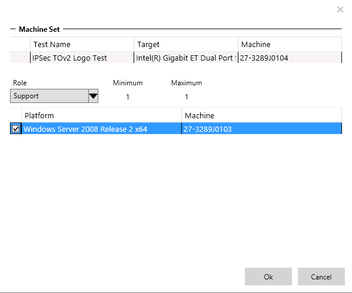

6.  The **Results** tab shows the step-by-step progress of the tests. The logs are also available once the tests complete.

    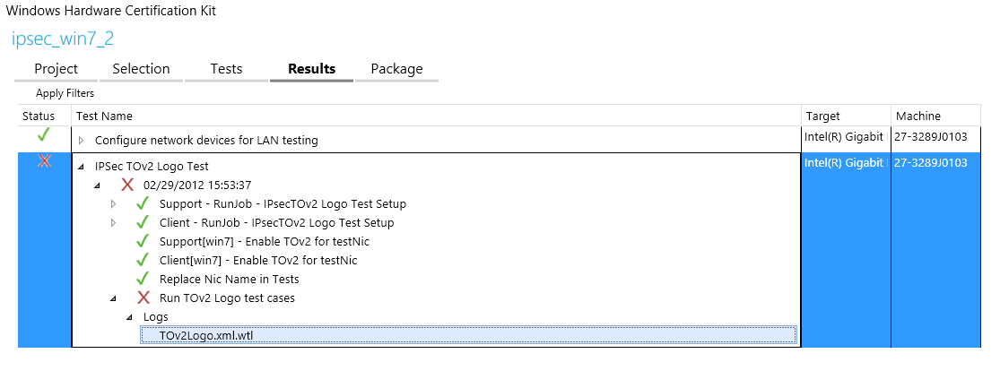

After you complete the preceding steps, the job is ready for scheduling. After you click Schedule Jobs, DTM Studio will send the job to the DTM controller and dispatch the job on the designated DTM client machines.

You can also put multiple configured jobs into the configured job list first, and then schedule them in one batch. After the test is finished, the log files are gathered and copied on the DTM controller.

The "IPsec Offloadv2 logo verification (Win7)" job tests to verify the support for IPsec Offloadv2. These end-to-end tests require a minimum of two machines. These tests plumb different types of IPsec policies and trigger traffic between these machines and measure characteristics of traffic, IPsec negotiations, and offloaded SA counts. In particular the test suite contains tests for:

1.  **Algorithm Testing for IPv4**: This test suite ensures that IPsec Task Offload v2 behaves correctly on different variations of algorithms of Authentication and Encryption for IPv4 traffic. Following combinations of algorithms are tested:

    -   AH\[AESGMAC128\]TCP

    -   AH\[AESGMAC128\]TCP\_authIP

    -   AH\[AESGMAC192\]TCP

    -   AH\[AESGMAC256\]TCP

    -   ESP\[None,GCM128\]TCP

    -   ESP\[None,GCM192\]TCP

    -   ESP\[None,GCM256\]TCP

    -   ESP\[GCM128,GCM128\]TCP

    -   ESP\[GCM192,GCM192\]TCP

    -   ESP\[GCM256,GCM256\]TCP

    -   AH+ESP\[GCM128,GCM128\]TCP

    -   AH+ESP\[GCM192,GCM192\]TCP

    -   AH+ESP\[GCM256,GCM256\]TDP

    -   AH\[AESGMAC128\]UDP

    -   AH\[AESGMAC192\]UDP

    -   AH\[AESGMAC256\]UDP

    -   ESP\[None,GCM128\]UDP

    -   ESP\[None,GCM192\]UDP

    -   ESP\[None,GCM256\]UDP

    -   ESP\[GCM128,GCM128\]UDP

    -   ESP\[GCM192,GCM192\]UDP

    -   ESP\[GCM256,GCM256\]UDP

    -   AH+ESP\[GCM128,GCM128\]UDP

    -   AH+ESP\[GCM192,GCM192\]UDP

    -   AH+ESP\[GCM256,GCM256\]UDP

    -   AH\[AESGMAC128\]UDP\_authIP

2.  **Algorithm Testing for IPv6**: This test suite does the above testing for IPv6 traffic.

3.  **Data Testing for IPv4**: This test suite ensures that IPsec Task Offload v2 behaves correctly on these scenarios:

    -   Protocols: TCP, UDP and ICMP traffic

    -   Different data sizes (Large size packet to exercise LSO offload)

    -   Different rekey intervals to test removals and additions of Offload SAs

    -   Tunnel mode

    -   Multiple security associations

4.  **Data Testing for IPv6**: This test suite does the above testing for IPv6 traffic.

As part of the logo test a service called ScenarioService gets installed on the clients. Details about this can be found in [IPsec Task Offload v2 Manual Test](ipsec-task-offload-v2-manual-test.md).

## Anatomy of a Test Case

The test script (Tov2Logo.xml in %SystemDrive%\\iketest\\suites) contains the details of all test cases. ScenarioService uses this XML file for running all tests. A test XML file is broadly divided into the following XML tags:

-   **Config**: Sets up the machine for the tests within the script. This mostly includes setting up private IP addresses for the test network, adding routes if necessary, and so on. This section also includes the cleanup once testing is complete.

-   **Group**: This is a logical construct for grouping tests within a specific area of testing.

-   **Test**: Title and description of each test variation.

-   **Action**: This tag corresponds to actions needed to be performed by a Client. The controller sends signals to each Client in the sequence defined by the action number. For the same action number, all Clients perform the encompassed actions asynchronously and return control to the Controller. Only when all Clients complete their action does the Controller send the signal for starting the next action.

## Understanding the logs

The following screen captures illustrate a sample test log for one test variation with comments explaining the entries:

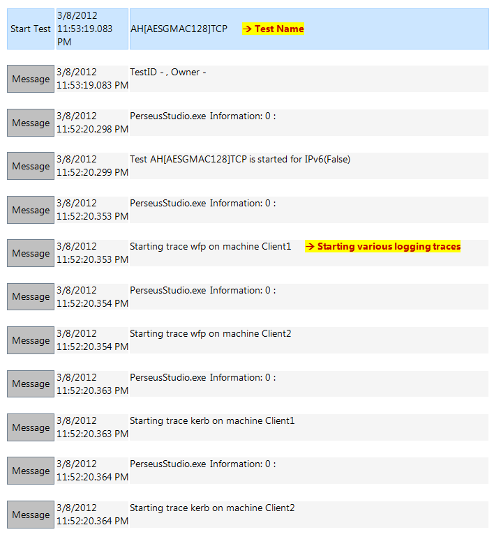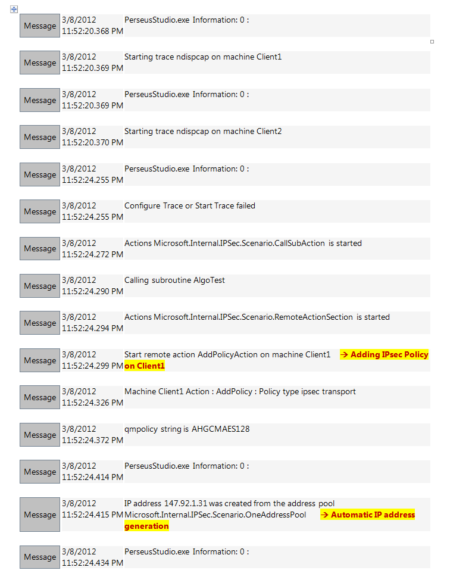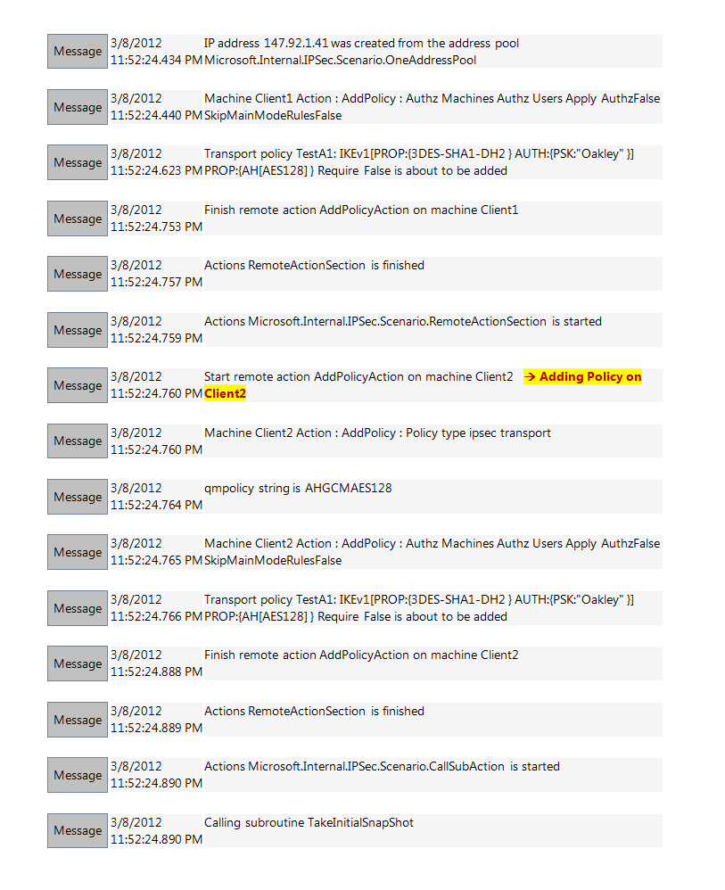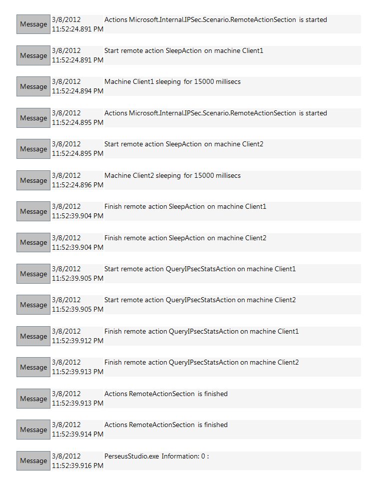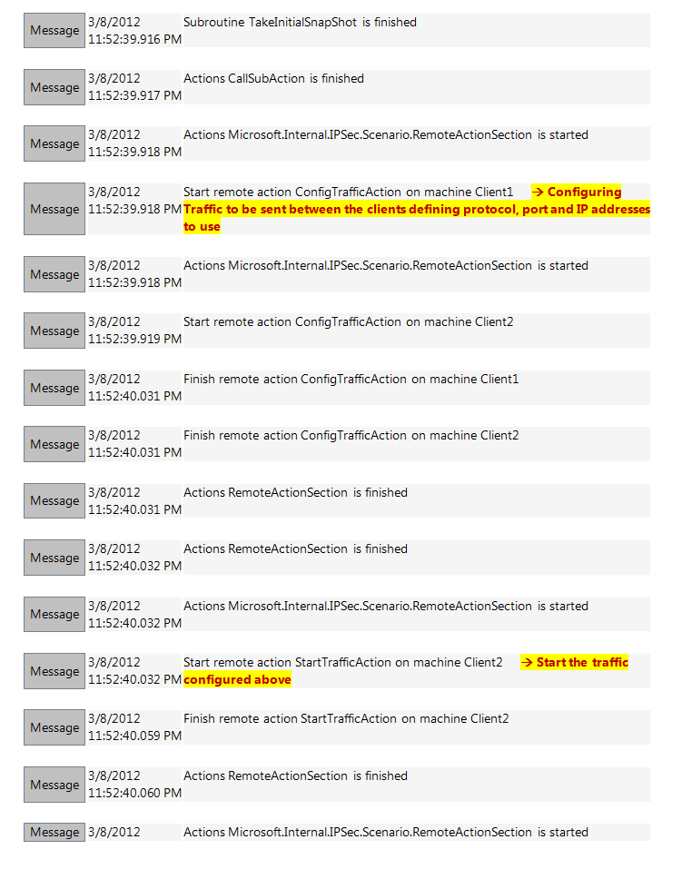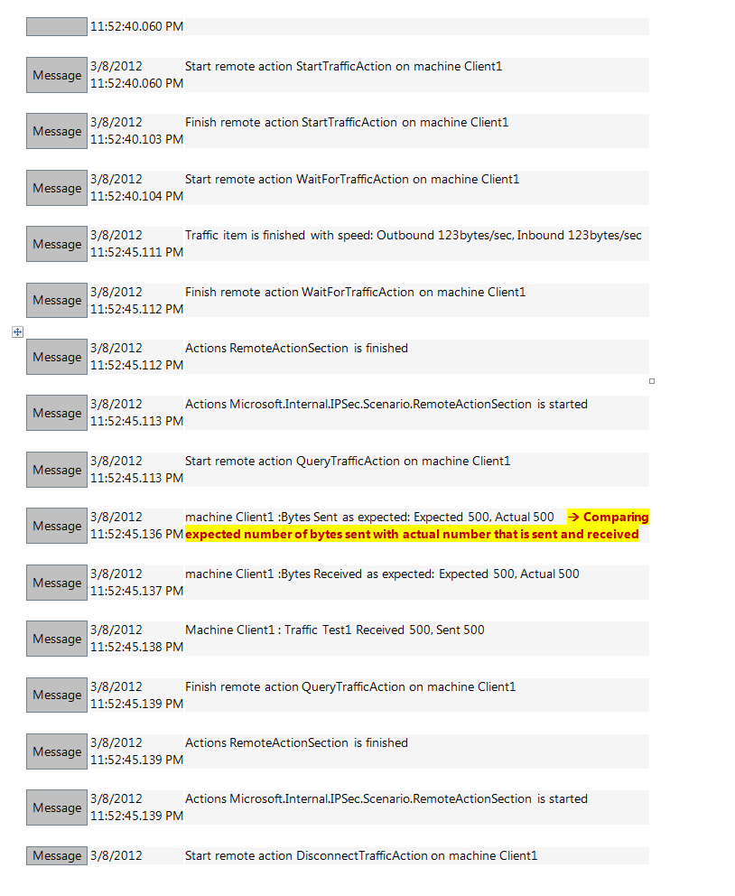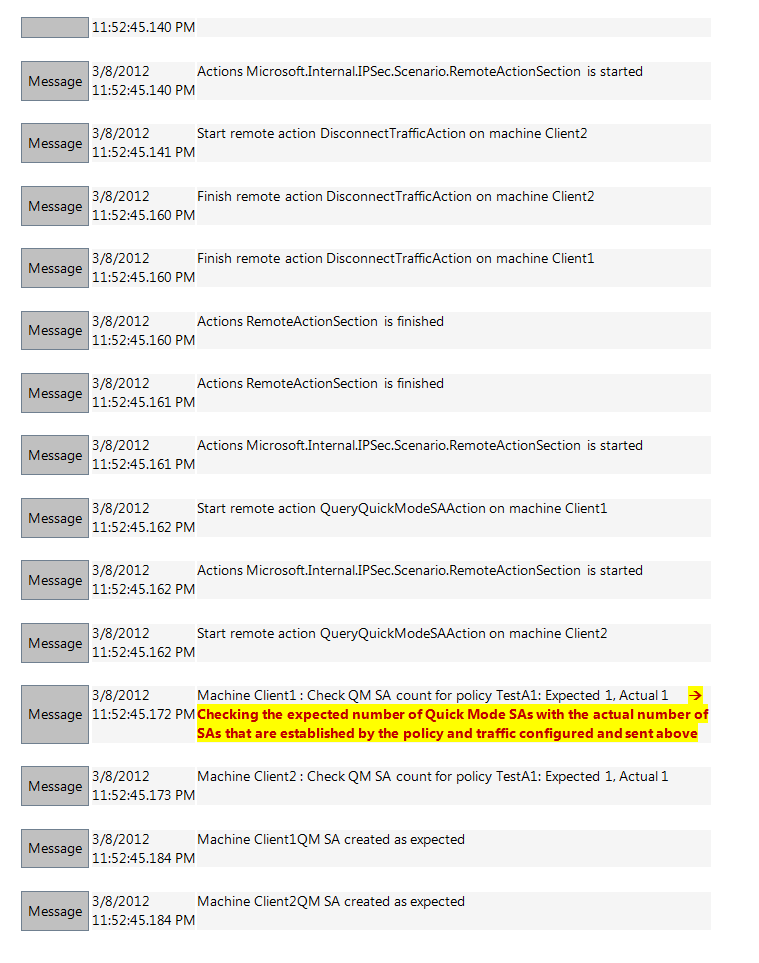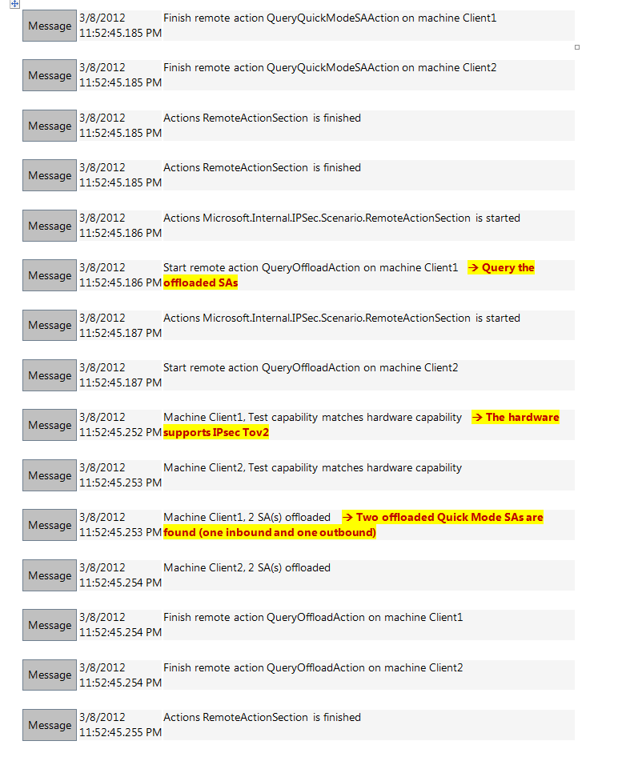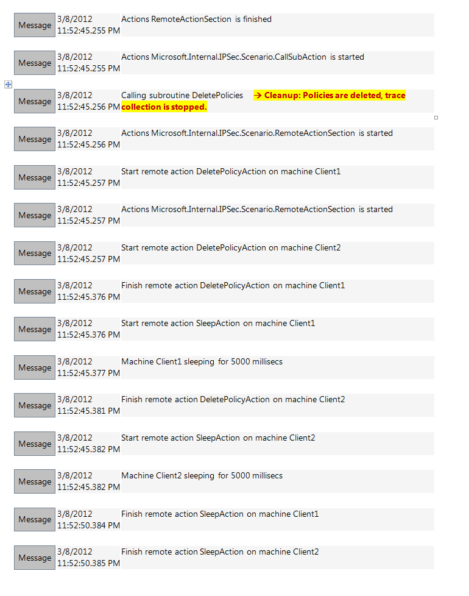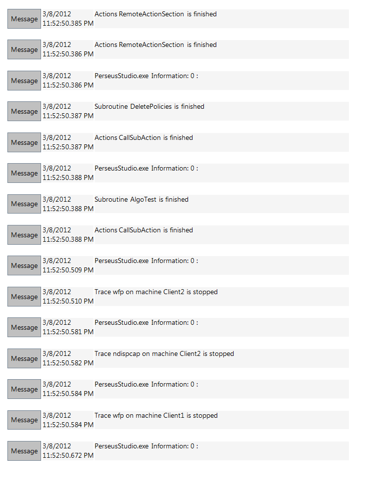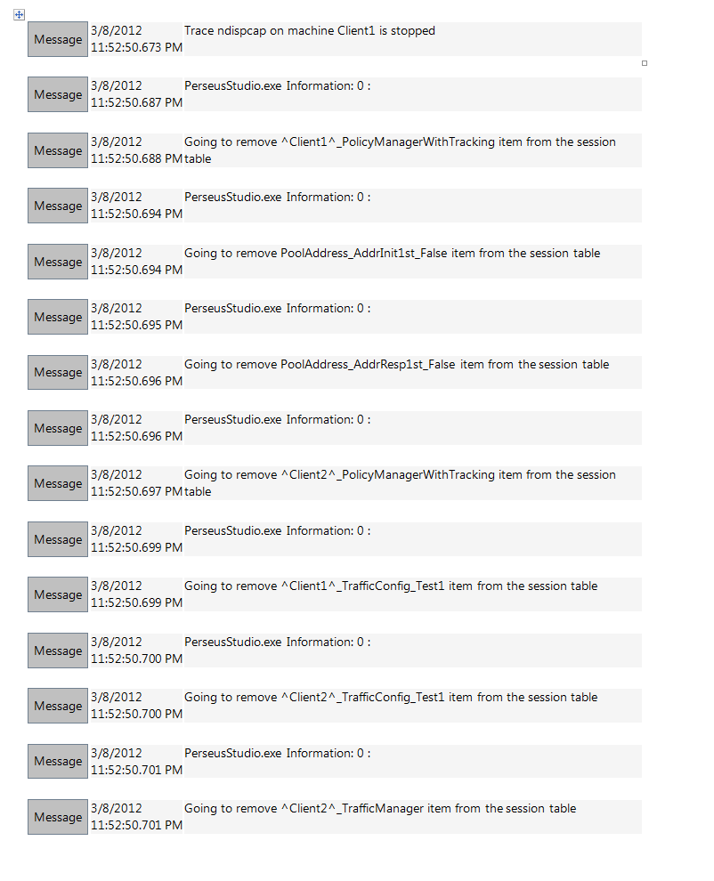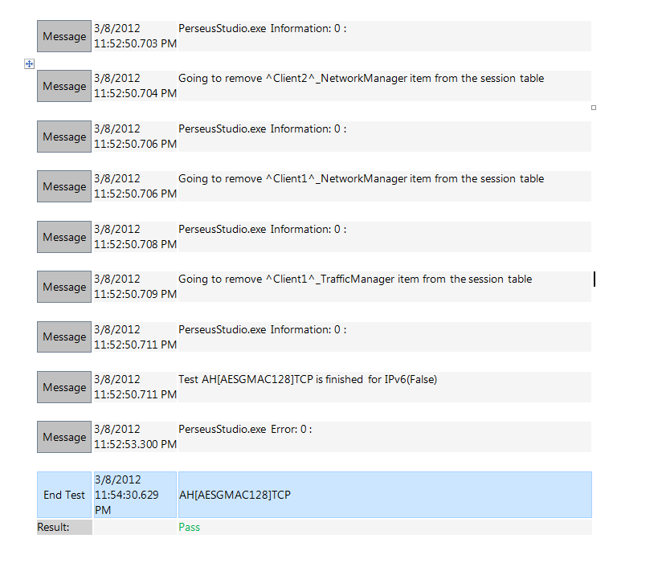

 

 

