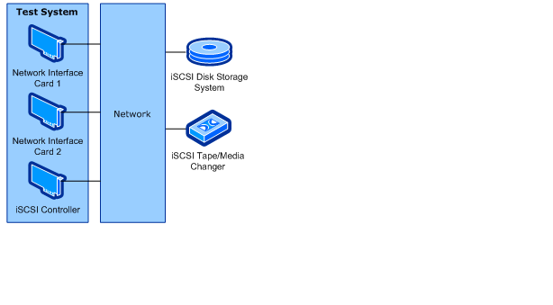
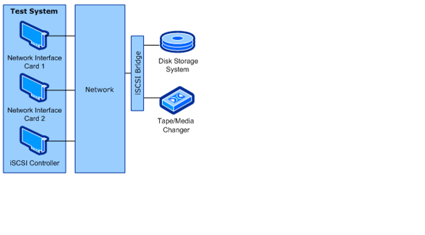

# iSCSI HBA Testing Prerequisites


This section describes the tasks that you must complete before you test an iSCSI host bus adapter (HBA) by using the Windows Hardware Lab Kit (Windows HLK):

-   [Hardware Requirements](#bkmk-hardwarerequirements).

-   [Software Requirements](#bkmk-softwarerequirements).

-   [Test computer configuration](#bkmk-configure).

## <span id="BKMK_HardwareRequirements"></span><span id="bkmk-hardwarerequirements"></span><span id="BKMK_HARDWAREREQUIREMENTS"></span>Hardware Requirements


You can run the iSCSI HBA tests in a single configuration. However, you can implement this configuration in one of two ways:

-   An iSCSI HBA, an iSCSI disk storage system, and an iSCSI tape medium changer

-   An iSCSI HBA, a bridge to another bus, a disk storage system, and an iSCSI tape medium changer

The following hardware is required for testing an iSCSI HBA adapter. You might need additional hardware if the test device offers other features. To determine whether additional hardware requirements apply, see the test description for each test that appears for the device in Windows HLK Studio.

>[!NOTE]
>  
With the exception of the test computer and the test controller, all hardware involved in the test must already have a logo.

 

-   One test computer. The test computer must meet the Windows HLK requirements as described in [Windows HLK Prerequisites](..\getstarted\windows-hlk-prerequisites.md) and the following operating system-specific requirements.

    -   For testing on Windows 8, Windows 7, Windows Vista or Windows XP:

        -   One dual-core or equivalent processor

        -   4 GB of memory

    -   For testing on Windows Server® 2012, Windows Server 2008 R2, Windows Server 2008, or Windows Server 2003:

        -   One quad-core or equivalent processor

        -   6 GB of memory

-   One iSCSI HBA (the test device).

-   One combination tape drive and medium changer device. If you are testing without a bridge, this device must be an iSCSI device. If you are testing with a bridge, this device must be a device that connects through another bus.

-   Two disk storage systems. If you are testing without a bridge, these systems must be iSCSI disk storage systems. If you are testing with a bridge, these systems must be disk storage systems that connect through another bus.

    >[!NOTE]
>  
    If the test device supports boot, you must have two disk targets. These targets can exist on the same disk storage device if they have different target names.

     

-   An iSCSI bridge, if you are testing in a configuration that has a bridge.

-   Three blank media cartridges for each drive on the medium changer device.

-   A monitor, keyboard, and mouse.

-   A boot-capable floppy disk drive, if your device supports boot.

-   Two (2) Gigabit Ethernet network adapters.

>[!NOTE]
>  
To certify your product for use on servers, the test computer must support four processors and a minimum of 1 GB of RAM. These system capabilities are required to test the Rebalance, D3 State, and Multiple Processor Group functionality of the device and driver. You do not need a computer that actually has more than 64 processors to test your device. Additionally, the server system(s) being used for device or driver testing must have Server Core installed prior to testing. For more information see [Windows Server Installation Options](http://go.microsoft.com/fwlink/p/?LinkID=251454).

If you use a pool of test computers to test devices, at least one computer in the pool must contain four processors and a minimum of 1 GB of RAM. Additionally, that computer must contain the device and the driver that you want to test. If the driver is the same on all the computers in the pool, the system creates a schedule to run against all test computers.

For tests that do not include a driver to test, such as hard disk drive tests, the Windows HLK scheduler constrains the tests that validate the device’s and driver’s rebalance, D3 state, and multiple processor groups functionality to run on the default test computer. You must manually configure this computer to have multiple processor groups. The default computer is the first test computer in the list. Test personnel must make sure that the first test computer in the list meets the minimum hardware requirements.

 

>[!NOTE]
>  
Except for para-virtualization drivers (as defined by the [WHCP Policies and Processes](http://go.microsoft.com/fwlink/p/?LinkID=615222) document), you may not use any form of virtualization when you test physical devices and their associated drivers for server certification or signature. All virtualization products do not support the underlying functionality that is required to pass the tests that relate to multiple processor groups, device power management, device PCI functionality, and other tests.

 

>[!NOTE]
>  Multiple Processor Groups Setting
You must set the value for the processor group size for Hardware Lab Kit testing of Windows Server 2008 R2 and later device drivers for certification. This is done by running bcdedit in an elevated command prompt window, using the /set option.

The commands for adding the group settings and restarting are as follows:

``` syntax
bcdedit.exe /set groupsize 2
bcdedit.exe /set groupaware on
shutdown.exe -r -t 0 -f
```

The commands for removing the group settings and rebooting are as follows:

``` syntax
bcdedit.exe /deletevalue groupsize
bcdedit.exe /deletevalue groupaware
shutdown.exe -r -t 0 -f
```

 

>[!NOTE]
>  
**Code Integrity Setting**

The Virtualization Based Security feature (VBS) of Windows Server 2016 must be enabled using Server Manager first.

Once that has occurred, the following Registry key must be created and set:

``` syntax
HKLM\System\CurrentControlSet\Control\DeviceGuard
HypervisorEnforcedCodeIntegrity:REG_DWORD
0 or 1 (disabled, enabled)
```

 

## <span id="BKMK_SoftwareRequirements"></span><span id="bkmk-softwarerequirements"></span><span id="BKMK_SOFTWAREREQUIREMENTS"></span>Software Requirements


The following software is required to test an iSCSI HBA adapter:

-   The drivers for the test device.

-   The latest Windows HLK filters or updates.

-   Windows symbol files. These are available from the [Symbol Files website](http://go.microsoft.com/fwlink/?LinkId=231439).

-   The current release of the Windows Driver Kit (WDK)

## <span id="BKMK_Configure"></span><span id="bkmk-configure"></span><span id="BKMK_CONFIGURE"></span>Test computer configuration


To configure the test computer to test an iSCSI HBA adapter, follow these steps:

1.  When the test computer is turned off, complete the following assembly steps:

    1.  Install the iSCSI controller in the test system.

    2.  Connect both 1 GB network cards to the network.

    3.  Connect the iSCSI controller to the test network. The test network is the network that contains the Windows HLK Studio and Windows HLK Controller.

    4.  If you are using an iSCSI bridge, connect the bridge to the network.

    5.  Do one of the following:

        1.  If you are using an iSCSI bridge, connect the disk storage system, combination tape, and medium changer to the bridge.

        2.  If you are not using an iSCSI bridge, connect the disk storage system, combination tape, and medium changer to the network.

        The following diagram shows the test system configuration without a bridge.

        

        The following diagram shows the test system configuration with a bridge.

        

2.  Turn on the test computer, install the appropriate Windows operating system, install all available Windows updates, and then configure the computer for your test network.

    If the iSCSI HBA supports boot, install the operating system on an iSCSI disk target that is different from the one that you will use for testing.

3.  If you have to install the manufacturer-supplied device driver on the test computer, do this now.

4.  Install the latest version of the iSCSI software initiator. This is available from the [Microsoft Download Center](http://go.microsoft.com/fwlink/?LinkId=229004).

5.  Use the iSCSI Control Panel to log on to all target devices. When you log on to the targets, select the **Automatically restore this connection when the system boots** check box.

    >[!IMPORTANT]
>  
    You must log on to all iSCSI target devices that you use for testing. You must not log on to any other iSCSI target devices. Otherwise, the WLK tests do not work correctly.

     

6.  Use Disk Management to create three 4-GB NTFS volumes on the disk storage system that does not contain the operating system. Assign each volume a drive letter.

7.  Use the iSCSI Control Panel to bind all of the drive letters that were created in the previous step.

8.  Complete the following procedure to set the system page file and enable crashdump:

    1.  Click the **Start** button, right-click **My Computer**, and then click **Properties.**

    2.  Click the **General** tab, and then note the amount of RAM that the computer contains.

    3.  Click the **Advanced** tab (or click **Advanced system settings** in the left pane for Windows Vista, Windows 7, Windows 8, Windows Server 2008, Windows Server 2008 R2 or Windows Server® 2012), and then, in the **Performance** area, click **Settings**.

        >[!NOTE]
>  
        If you are prompted to enter administrative credentials or allow the action, enter the credentials or allow the action.

         

    4.  Click the **Advanced** tab, and then, in the **Virtual Memory** area, click **Change**.

    5.  Select **Custom Size**, and then enter a number in the **Initial size (MB)** box that is larger than the size of RAM that you noted in step b.

    6.  In the **Maximum size (MB)** text box, enter a maximum size value that is larger than the initial size that you entered in the **Initial size (MB)** box. (The maximum size is typically 1.5 to 2 times the initial size.)

    7.  Click **Set**, and then click **OK** two times.

    8.  Click **OK**, and then restart the computer to update the page file size.

9.  Copy the Windows symbol files to %SystemDrive%\\Symbols.

10. Verify that Windows can access the storage using the iSCSi HBA.

11. Install the Windows HLK client application on the test computer.

12. Use Windows HLK Studio to create a computer pool, and then move the test computer to that pool.

Make sure that the test computer is in the ready state before you begin your testing. Also, when you schedule any iSCSI HBA tests, set up the communication between the HBA (initiator) and the iSCSI targets. If a test requires parameters to be set before it is run, a dialog box will appear for that test. Review the specific test topic for more information.

Some Windows HLK tests require user intervention. When you run tests for a submission, it is a best practice to run the automated tests in a block separately from manual tests. This prevents a manual test from interrupting completion of an automated test.

>[!WARNING]
>  
When testing storage devices, we strongly recommend that you complete all Device Fundamentals tests before starting storage tests. Storage tests will reconfigure your test device, leaving the device in a state unsuitable to support Device Fundamentals tests. The following configurations provide steps to create volume on the storage test device. This is important to complete the Device Fundamental part of testing (DevFund).

 

 

 


