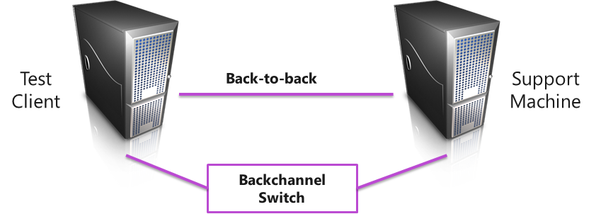
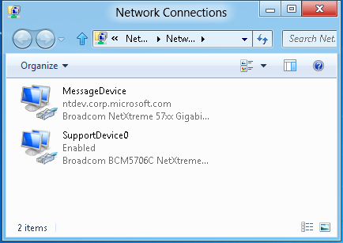
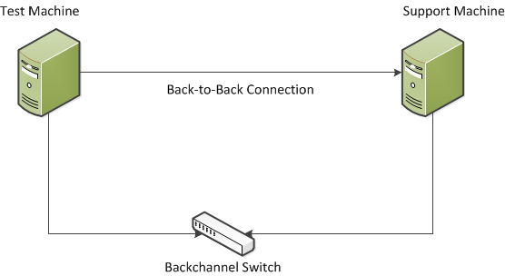

# LAN Testing Prerequisites


The content in this section describes the LAN (Ethernet) testing prerequisites that you should complete before testing your network adapter using the Windows Hardware Lab Kit (Windows HLK).

**Note**  
This content applies to both stand-alone network adapters and integrated network devices.

 

**Document Terms**

<table>
<colgroup>
<col width="50%" />
<col width="50%" />
</colgroup>
<thead>
<tr class="header">
<th>Device Role</th>
<th>Interface Alias</th>
</tr>
</thead>
<tbody>
<tr class="odd">
<td><p>Test machine, test target (DUT)</p></td>
<td><p>No name necessary, HLK jobs will automatically choose it</p></td>
</tr>
<tr class="even">
<td><p>Test machine, message device</p></td>
<td><p>MessageDevice</p></td>
</tr>
<tr class="odd">
<td><p>Support machine, support device</p></td>
<td><p>SupportDevice0</p></td>
</tr>
<tr class="even">
<td><p>Support machine, message device</p></td>
<td><p>MessageDevice</p></td>
</tr>
<tr class="odd">
<td><p>LWF driver</p></td>
<td><p>NDIS Light Weight Filter driver</p></td>
</tr>
</tbody>
</table>

 

## <span id="Machine_topology"></span><span id="machine_topology"></span><span id="MACHINE_TOPOLOGY"></span>Machine topology


The following diagram shows the recommended machine topology. Topologies that differ from this are highly discouraged as they may require extra effort in order to get the tests running correctly.



This is the topology that applies to all LAN devices (including devices which support QoS and Chimney).

### <span id="Test_connections"></span><span id="test_connections"></span><span id="TEST_CONNECTIONS"></span>Test connections

The back-to-back connection is preferred in general as it takes away the possibility of the switch from interfering with the test (VLAN misconfigurations, flow control packets, and so on)

A back-to-back connection is required for tests which a network switch may interfere with the result. Such tests include:

-   QoS (aka. DCB) (priority flow control, LLDP/DCBX interop, ETS (as some switches may strip 802.1p tags)

-   Tx Flow Control

-   Tests which send 802.1q–tagged (VlanSendRecv, VMQ, 1c\_priority, maybe others)

### <span id="Backchannel_corporate_network"></span><span id="backchannel_corporate_network"></span><span id="BACKCHANNEL_CORPORATE_NETWORK"></span>Backchannel/corporate network

It is recommended that the backchannel switch be the same network which the test machines will use to communicate with the HLK controller. It is recommended that this network be DHCP enabled.

### <span id="Machine_requirements"></span><span id="machine_requirements"></span><span id="MACHINE_REQUIREMENTS"></span>Machine requirements

The machine requirements are often dictated by the features which the test target supports. Certification on client SKUs will require 2 processing cores while certification on server SKUs will require 4 processing cores.

**Note**  
The term *cores* refers to physical processing cores (not virtual or hyper-threaded cores). If your device supports advanced features such as the ones below, then the minimum system requirements may be increased.

 

-   Wake-on-LAN: system must support power management (S3)

-   RSS: maximum of either 4 physical cores or the default number of RSS queues supported by the device

    -   Example: if a 1G NIC supports 2 queues, the number of required cores would be 4

    -   Example: if a 10G NIC supports 8 queues, the number of required cores would be 8

-   Server/QoS: Systems must be capable of saturating 90% of max link rate

-   QoS: storage target writes at 20% of max link rate

**Note**  
If send/receive packet loss problems happen frequently and throughout the test, it’s not likely a selective suspend problem.

 

**Note**  
To certify your product for use on servers, the test computer must support four processors and a minimum of 1 GB of RAM. These system capabilities are required to test the Rebalance, D3 State, and Multiple Processor Group functionality of the device and driver. You do not need a computer that actually has more than 64 processors to test your device. Additionally, the server system(s) being used for device or driver testing must have Server Core installed prior to testing. For more information see [Windows Server Installation Options](http://go.microsoft.com/fwlink/p/?LinkID=251454).

If you use a pool of test computers to test devices, at least one computer in the pool must contain four processors and a minimum of 1 GB of RAM. Additionally, that computer must contain the device and the driver that you want to test. If the driver is the same on all the computers in the pool, the system creates a schedule to run against all test computers.

For tests that do not include a driver to test, such as hard disk drive tests, the Windows HLK scheduler constrains the tests that validate the device’s and driver’s rebalance, D3 state, and multiple processor groups functionality to run on the default test computer. You must manually configure this computer to have multiple processor groups. The default computer is the first test computer in the list. Test personnel must make sure that the first test computer in the list meets the minimum hardware requirements.

 

**Note**  
Except for para-virtualization drivers (as defined by the [WHCP Policies and Processes](http://go.microsoft.com/fwlink/p/?LinkID=615222) document), you may not use any form of virtualization when you test physical devices and their associated drivers for server certification or signature. All virtualization products do not support the underlying functionality that is required to pass the tests that relate to multiple processor groups, device power management, device PCI functionality, and other tests.

 

**Note**  Multiple Processor Groups Setting
You must set the value for the processor group size for Hardware Lab Kit testing of Windows Server 2008 R2 and later device drivers for certification. This is done by running bcdedit in an elevated command prompt window, using the /set option.

The commands for adding the group settings and restarting are as follows:

``` syntax
bcdedit.exe /set groupsize 2
bcdedit.exe /set groupaware on
shutdown.exe -r -t 0 -f
```

The commands for removing the group settings and rebooting are as follows:

``` syntax
bcdedit.exe /deletevalue groupsize
bcdedit.exe /deletevalue groupaware
shutdown.exe -r -t 0 -f
```

 

**Note**  
**Code Integrity Setting**

The Virtualization Based Security feature (VBS) of Windows Server 2016 must be enabled using Server Manager first.

Once that has occurred, the following Registry key must be created and set:

``` syntax
HKLM\System\CurrentControlSet\Control\DeviceGuard
HypervisorEnforcedCodeIntegrity:REG_DWORD
0 or 1 (disabled, enabled)
```

 

## <span id="Machine_configuration"></span><span id="machine_configuration"></span><span id="MACHINE_CONFIGURATION"></span>Machine configuration


Some tests require unique configuration that is not or cannot be automatically taken care of by test jobs. The below list outlines which tests require unique configurations.

### <span id="QosStorageInterop_"></span><span id="qosstorageinterop_"></span><span id="QOSSTORAGEINTEROP_"></span>QosStorageInterop

The test target on the DUT machine must have connectivity to network-based storage using either iSCSI or SMB. The test machine topology is such that the test network is back-to-back which means the support machine must also serve as a storage target. This means a software iSCSI target must be configured on the SUT or an SMB share must be shared out. The DUT machine must map the storage target to a drive letter and the user must ensure that this connection flows over the test network and not the backchannel network. Once configured, you must input two additional parameters to this job at schedule time:

-   Drive letter

-   Storage mode (iSCSI or ND (Network Direct))

### <span id="Selective_suspend"></span><span id="selective_suspend"></span><span id="SELECTIVE_SUSPEND"></span>Selective suspend

The NDIS Selective Suspend feature may have a negative impact on test results. Many of the network certification tests assume a device is in a powered-on and ready-to-use state. Thus, many of the tests may quickly send or receive traffic and expect all packets to be sent or received appropriately. If a device is in low power (Selective Suspend), it may take a short while for the device to resume which may result in packet loss during the resume period.

Microsoft recommends configuring \*SelectiveSuspend to disabled if the following are true (note: do not change the default value, just the operational value while running the certification tests):

-   A customer has a selective suspend capable device

-   Send/receive tests are experiencing packet loss problems

-   Send/receive test packet loss problems are only in the FIRST variation of a given test

## <span id="Overview_of_changes_in_network_device_selection"></span><span id="overview_of_changes_in_network_device_selection"></span><span id="OVERVIEW_OF_CHANGES_IN_NETWORK_DEVICE_SELECTION"></span>Overview of changes in network device selection


For LAN device testing, message and support adapters are no longer selected using a UI—they are automatically detected based on the network topology. If the automatic detection fails because the network topology is different than recommended topology, the devices need to be renamed on the test and support machines before running tests. Renaming refers to the device’s “ifAlias” which is visible from the Network Connections window among other places.

If renaming is required, the support device on the support machine needs to be renamed to “SupportDevice0”. The message devices on both the test and support machines need to be renamed to “MessageDevice”.



## <span id="Automatic_device_selection_criteria"></span><span id="automatic_device_selection_criteria"></span><span id="AUTOMATIC_DEVICE_SELECTION_CRITERIA"></span>Automatic device selection criteria


The test and support machines must be set up in the same configuration as Figure 4 and all other Ethernet devices/ports not involved in testing need to be disconnected or disabled. The test jobs use the following criteria to find the message device: Ethernet device, link connected, enabled, TCP bound, IP address assigned using DHCP. Detection will include adapters with static IP addresses if no adapters are with DHCP assigned addresses are found. The message adapter is typically connected to the HLK controller and normal corporate network. Once the message device is found the job searches the remaining adapters for a support device that is an Ethernet device, link connected, and enabled.



## <span id="Running_the_LAN_tests_in_the_HLK"></span><span id="running_the_lan_tests_in_the_hlk"></span><span id="RUNNING_THE_LAN_TESTS_IN_THE_HLK"></span>Running the LAN tests in the HLK


Please refer the HLK help for information on setting up the controller and the client machines.This document only deals with the execution of LAN content in the HLK.

Once the Controller and Client machines are setup, follow these steps for running the LAN tests:

1.  Create a project in HLK studio.

2.  Create a new machine pool, and add the client machines that were setup to the newly created pool, and mark the machine status as ready.

3.  Make sure the test machine and support machine are connected as described in the **Device Selection Criteria** section above.

4.  Select only the device/driver to be tested (such as **device manager** or **software device**), in the **Selection** tab of HLK studio.

5.  Select the jobs that appear in the list on the **Tests** tab of the HLK studio.

6.  Click **Run Selected**, and choose the Support machine for the test run, and click **OK**.

## <span id="Running_filter_logo_tests"></span><span id="running_filter_logo_tests"></span><span id="RUNNING_FILTER_LOGO_TESTS"></span>Running filter logo tests


Use the following steps to run lightweight filter (LWF) logo tests:

1.  Setup/Configure the DTM Server and the DTM Client machines. Filter Logo tests need just the one client machine.

2.  Install the LWF driver on the client machine.

3.  Restart the client machine.

4.  From DTM server, add the client on which the LWF is installed to a new machine pool, and change the machine status to ‘Ready’.

5.  From HLK studio, create a new project under the ‘Project’ tab in HLK Studio.

6.  In the ‘Selection’ tab of the HLK studio, Select the machine pool that was created in the previous steps from the dropdown.

7.  Click **software device**, and select the installed LWF driver you want to test.

    

8.  Run the all tests (the ‘NDISTest 6.5 – LWF Logo Test’ checks for all the LWF requirements) listed in the **Tests** tab against the LWF driver.

### <span id="NDISTest_6.5_-_LWF_logo_test"></span><span id="ndistest_6.5_-_lwf_logo_test"></span><span id="NDISTEST_6.5_-_LWF_LOGO_TEST"></span>NDISTest 6.5 - LWF logo test

This test targets LWF by ensuring that the filter is able to process packets that are larger than miniport's MTU size.

This also runs a filter stress test to stress the datapath and PNP paths of NDIS filter drivers.  The test will limit the test virtual miniports receive descriptors such that a significant number of receive indications will happen with the receive resources flag.  The test will then conduct the following actions in a multi-threaded manner:

-   Stress traffic from the support miniport directed to the test miniport.

-   Stress traffic from the test miniport directed to the support miniport

-   Stop/start the test miniport (which will trigger a pause and subsequent restart operations).

-   Test adapter indicating media disconnected/connected.

-   Test adapter resetting.

    Finally, basic send and receive connectivity will be tested between the test/support adapters.

## <span id="related_topics"></span>Related topics


[Device.Network Testing](device-network-tests.md)

 

 


