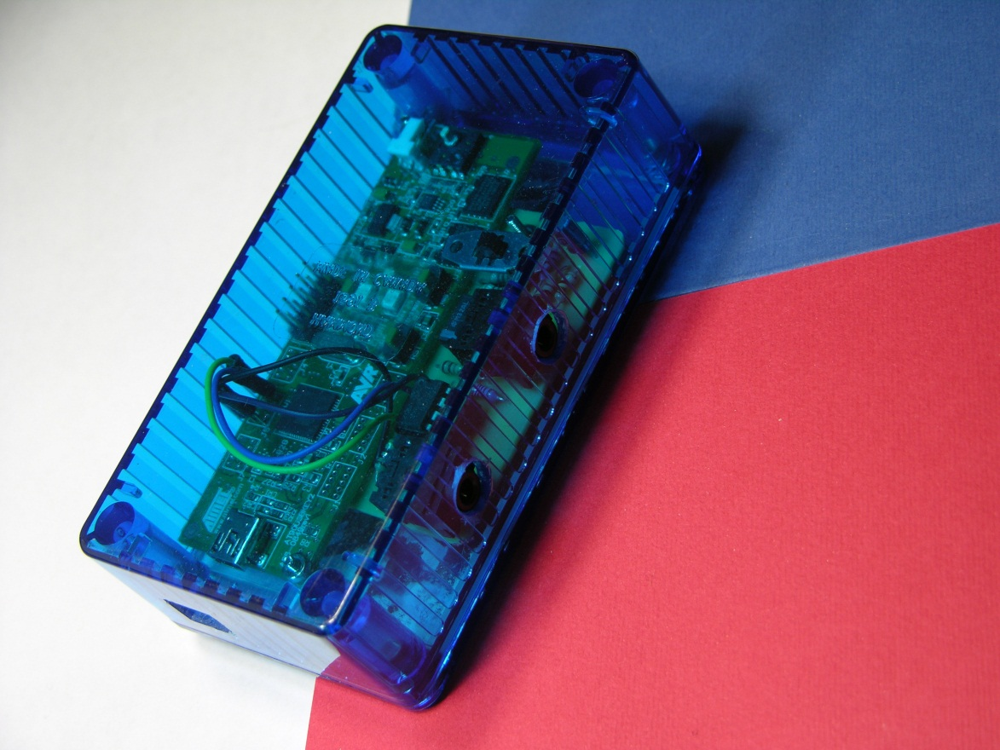
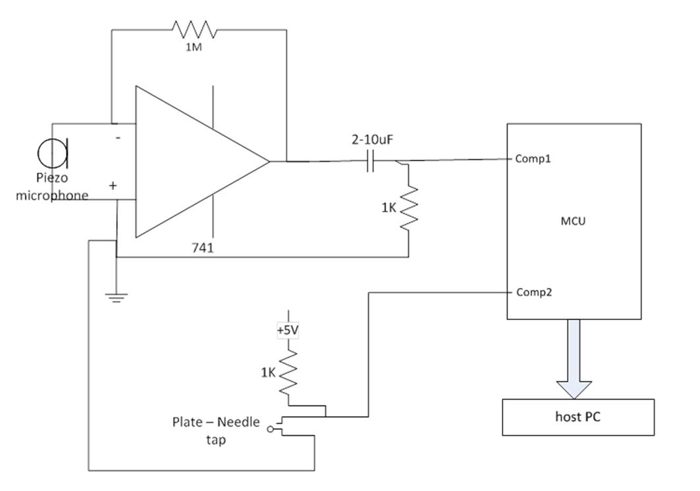
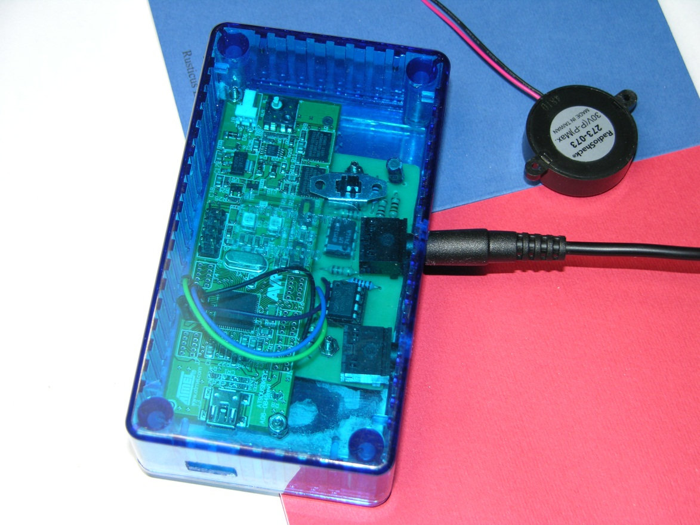
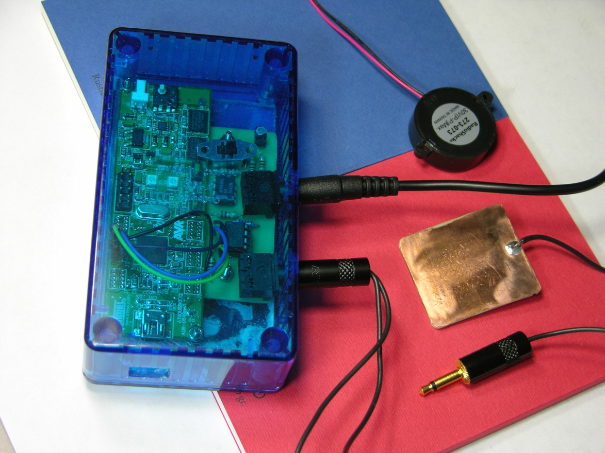
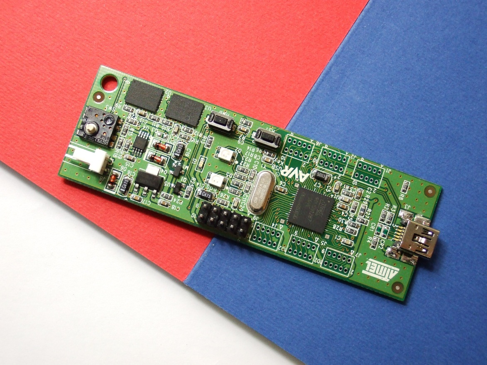
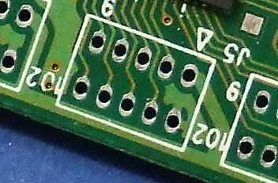

# Overview of measuring Touch Down Hardware Latency

Latency is a measure of time delay experienced in the touch digitizer system. Inherent latency of a system is one of the most important parameters of the touch device and always represents a tradeoff between several important features: noise levels (SNR), sensitivity, power consumption, jitter, and so on.

The starting point for latency measurement is a well-defined standard; it is the moment at which the finger or stylus (actuator) touches the screen for the first time in a given contact. The end point for touch down hardware latency is the moment when the host operating system (for example, Windows 8) becomes aware of the message from the target touch digitizer (for USB devices this is the moment when the bulk interrupt request is detected on a dedicated USB controller for touch digitizers; usually this request indicates an incoming HID report with initial contact information.) For all practical purposes this end point is identical to that of the WndProc end point, which is the moment when the host application first becomes aware of contact (for example through WM\_INPUT and WM\_POINTER messages for native applications, or via a Windows::UI::Input::PointerPoint message for Windows Store applications).

## Methodology

This procedure relies on the acoustic/mechanical wave produced by the finger touching the digitizer in order to measure this latency. It is worth noting that even the slightest touch contact will produce a substantial acoustic/mechanical wave on the digitizer’s surface, which can clearly and unambiguously (that is, with extremely high SNR, virtually zero false positives, and almost no false negatives) be detected using even the simplest off-the-shelf microphones.

Methodology relies on the test subject manually touching the touch screen a number of times. This is because latency is probabilistic in nature – due to uncertainty inherent in the scanning function). This allows us to build an empirical cumulative distribution function. Predictable expectations for this function exist, enabling estimating the quality of the overall measurement. Using this data, you can extract basic parameters for the distribution.

Each measurement is executed fairly simply: a test subject touches the digitizer with a finger, creating the acoustic/mechanical wave. A small-but-measurable delay between the actual contact and the moment the wave reaches the microphone on the digitizer is recorded. The wave is then detected by the microphone, amplified and thresholded appropriately, hence it is being converted to logical 0 or 1 level). This logical value is fed into the microcontroller board (for example, an AT90USBKEY2), which accepts this change with low latency (~µs) and transmits it to the device under test with at most 1ms latency, via a USB HID report (1ms is the minimum polling period for full-speed USB devices such as the AT90USBKEY2).

On the host (that is, the device under test) side, two events are being anticipated. The first is the reception of an HID report from the microcontroller board, indicating that physical contact took place. The second is the HID report from the touch digitizer. The difference in time between the two reports represents the touch down latency.

There are two uncertainties in this measurement; a method was devised to reduce both. The first uncertainty is that there is a time delay between the actual contact and the time the wave reaches the microphone (or to be more specific, between the actual contact and the time logical 1 is received on the microcontroller). This is compensated for by adding an additional step to the methodology – a calibration. Before beginning latency measurements, the time it takes for the wave to propagate from the farthest position on the digitizer to the microphone (microcontroller) is measured. This information is used to provide an absolute error estimate for each individual measurement later. In most cases this is below 2ms (depending on the size of the screen and materials used for the digitizer’s surface).

The second uncertainty is the latency introduced by the USB channel between the microcontroller and the host computer (the device under test). This is dealt with by introducing a 48-bit timestamp to each HID report from the microcontroller. This timestamp is set when logical 1 has been detected on the input port of the microcontroller (with ~µs latency between this event and the generation of the timestamp value). Then the clocks on the host (the computer being tested) and the target (microcontroller) side can be synchronized to yield the most precise results.

This methodology can be fully automated and is fully repeatable; a robot could be used to induce touch instead of a human participant. Instead, the simpler solution, relying on a human participant and natural measurement, with simpler and more convenient setup is recommended. Observed results indicate consistent precision, which indicates that a balance has been achieved between the complexity of the setup and the precision of the measurement.

## Hardware Requirements

This section details the required hardware components. The purpose for of piece of equipment is described but actual part numbers are not provided here (these will be provided later in this paper.

-   A microphone – to detect acoustical waves on the touch digitizer. A small and flat piezoelectric microphone that can easily be taped to the touch screen is recommended.

-   An acoustic amplifier – to amplify the signal from the microphone.

-   A thresholding circuit – to distinguish touch sound from environmental noise.

-   A microcontroller board with USB HID capability and polling ability on at least two input ports with ~µs latency.

-   Calibration circuit – to measure acoustic wave propagation, that is, the time between the touch occurring and logical 1 being received on the microcontroller.

The next section discusses an implementation of touch down latency measurement setup.

## Detailed Instructions

The hardware device to perform measurements is presented in the following image. The box has three holes: microphone input, calibration metal plate input, and microcontroller micro USB output.

The next image shows the circuit for the microphone, acoustic amplifier and thresholder. The microcontroller comparator can be used to apply threshold.

The microphone connection is shown in the following image. Note that a very simple off-the-shelf microphone is being used in this setup, sufficient to reliably and accurately discriminate between taps and environmental noise.

Calibration plate input goes in the other hole, as shown in the following image.

The microcontroller board used is AT90USBKEY2.

As described in methodology, this microcontroller board is used to detect changes on the output of the thresholding circuit, namely logical 0 and 1 (the same for calibration and metal plate). When an audio signal is detected with a magnitude exceeding the threshold, that change is detected and a HID report is sent to the host for each such event. As the sound wave oscillates, the threshold will be exceeded multiple times; in order to avoid sending a change event each time the threshold exceeded, the controller logic must ignore the audio signal for some period of time after each change event. That time interval should be long enough so that final result is only one change event per finger tapping. Durations longer than 500ms usually work. Alternatively a mono-stable multivibrator can be used or an additional logical circuit can be used, placed after the audio amplifier and MCU input. In order to reuse the recommended setup (firmware + software) you must feed the output of the audio thresholding circuit into the input pin C0 and the output of the metal plate circuit to the input C1. The microcontroller board and the thresholding circuit should have a shared ground (the grounds should be connected). The placement of pins C0 and C1 as well as the ground is shown in the following two images.

The red rectangle delineated area (port C of the AT90USBKEY board) of the preceding image is shown zoomed-in in the following image, with pins C0, C1 and ground marked appropriately.

For more information about this board please visit manufacturer’s [web site](http://www.atmel.com/tools/AT90USBKEY.aspx) and [hardware user guide](http://www.atmel.com/Images/doc7627.pdf) for the board.

 

 

[Send comments about this topic to Microsoft](mailto:wsddocfb@microsoft.com?subject=Documentation%20feedback%20%5Bp_hlk_test\p_hlk_test%5D:%20Overview%20of%20measuring%20Touch%20Down%20Hardware%20Latency%20%20RELEASE:%20%288/29/2017%29&body=%0A%0APRIVACY%20STATEMENT%0A%0AWe%20use%20your%20feedback%20to%20improve%20the%20documentation.%20We%20don't%20use%20your%20email%20address%20for%20any%20other%20purpose,%20and%20we'll%20remove%20your%20email%20address%20from%20our%20system%20after%20the%20issue%20that%20you're%20reporting%20is%20fixed.%20While%20we're%20working%20to%20fix%20this%20issue,%20we%20might%20send%20you%20an%20email%20message%20to%20ask%20for%20more%20info.%20Later,%20we%20might%20also%20send%20you%20an%20email%20message%20to%20let%20you%20know%20that%20we've%20addressed%20your%20feedback.%0A%0AFor%20more%20info%20about%20Microsoft's%20privacy%20policy,%20see%20http://privacy.microsoft.com/en-us/default.aspx. "Send comments about this topic to Microsoft")

