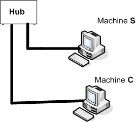

# Troubleshooting Wireless Router Testing

To troubleshoot issues that occur with Device.Network tests, follow these steps:

-   Review the [Troubleshooting Windows HLK](p_hlk.troubleshooting_windows_hlk) topic.

-   Review the [Windows HLK release notes](http://go.microsoft.com/fwlink/?LinkID=236110) for current test issues.

-   For a test failure, look for usable information in the Windows HLK Studio test log. If you find usable information, resolve the issue and rerun the test.

Use the following steps to test the ability of a computer to send higher bit rates over an Ethernet connection:

1.  Setup the hardware as shown below with only Ethernet connection.

2.  Assign the IP address to Machine **S** (for example: 10.0.0.2).

3.  Assign the IP address to Machine C (for example: 10.0.0.3).

4.  Open a command prompt and run Stats tool on Machine **C** with following parameters:

    **stats.exe –z DISCARD –i 20 –x 50 –y 30 –r 20000000 –c 3600 –l –h -u**

5.  Open the MS command prompt and run Stats tool at the Machine S with following parameters:

    **stats.exe –d 10.0.0.3 –r 20000000 –c 4200 –l –h -u**

6.  Observe the output of steps 4 and Step 5.

If the output of either step 4 or step 5 shows any failures then your machines cannot make bit rates using wireless adapters.

To manually add a wireless profile, use the following command:

**netsh wlan add profile filename=&lt;xmlfilename&gt; i=\***

For example, to add the 802\_11n\_wpa-psk.xml wireless profile:

1.  Click **Start**, click **Run**, and enter **cmd.exe**.

2.  Type **netsh wlan add profile filename=802\_11n\_wpa-psk.xml i=\***.

3.  Click **OK**.

**Note**  
Make sure that Wireless Profile XML file exists in the current directory or specify the full path.

 

## Related topics

[Device.Network Testing](device-network-tests.md)

 

 

[Send comments about this topic to Microsoft](mailto:wsddocfb@microsoft.com?subject=Documentation%20feedback%20%5Bp_hlk_test\p_hlk_test%5D:%20Troubleshooting%20Wireless%20Router%20Testing%20%20RELEASE:%20%288/29/2017%29&body=%0A%0APRIVACY%20STATEMENT%0A%0AWe%20use%20your%20feedback%20to%20improve%20the%20documentation.%20We%20don't%20use%20your%20email%20address%20for%20any%20other%20purpose,%20and%20we'll%20remove%20your%20email%20address%20from%20our%20system%20after%20the%20issue%20that%20you're%20reporting%20is%20fixed.%20While%20we're%20working%20to%20fix%20this%20issue,%20we%20might%20send%20you%20an%20email%20message%20to%20ask%20for%20more%20info.%20Later,%20we%20might%20also%20send%20you%20an%20email%20message%20to%20let%20you%20know%20that%20we've%20addressed%20your%20feedback.%0A%0AFor%20more%20info%20about%20Microsoft's%20privacy%20policy,%20see%20http://privacy.microsoft.com/en-us/default.aspx. "Send comments about this topic to Microsoft")

