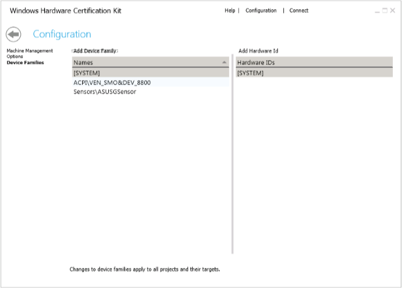

# Configuration Page - Device Families

The Device Families page lets you manage device family and hardware Ids settings.

To enable distributed testing, similar targets must be selected. For targets to be considered similar, they must, among other things, have the same hardware Id. Device Families are used to "override" associate two devices with different hardware Ids but are, otherwise, similar

-   To create a device family, click **Add Device Family**. The new device family is named "Device Family 1" by default. You can change that by typing a different name and then pressing **Enter**.

-   To associate hardware Ids, click **Add Hardware Id**. The new hardware id is named "Device\_Family\_1\_1" by default. You can change that by typing a different name and then pressing **Enter**.

>[!NOTE]
>  
Note: A hardware Id can only exist in one Device Family for the entire controller. For more information on distributed testing, see [Select targets for distributed testing](select-targets-for-distributed-testing.md).

 

 

 

